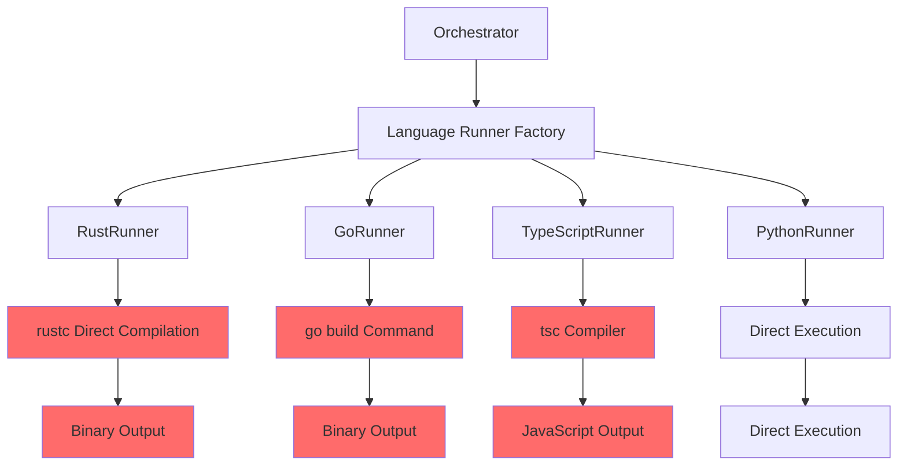
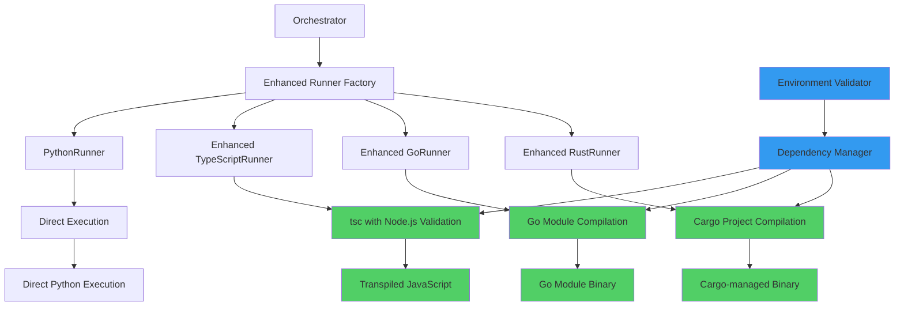

# Multi-Language Benchmark Compilation Fixes Design

## Overview

This design addresses critical compilation failures in the multi-language benchmark tool that prevent proper execution of Rust, Go, and TypeScript tests. The tool currently experiences dependency issues, missing compilers, and project structure problems that result in failed compilation across all compiled languages.

## Problem Analysis

### Current Issues Identified

**Rust Compilation Failures:**
- Missing `rand` crate dependency in multiple test files
- No `Cargo.toml` files for dependency management
- Tests use external dependencies but compile as standalone files
- Error: `failed to resolve: use of unresolved module or unlinked crate 'rand'`
- **STATUS: RESOLVED** - All Rust compilation issues have been fixed including tempfile dependency detection

**Go Compilation Failures:**
- Silent compilation failures with no error output
- Potential missing imports or module issues
- Binary execution fails despite successful Go installation validation
- **STATUS: RESOLVED** - All Go compilation issues have been fixed including memory allocation test

**TypeScript Compilation Failures:**
- Missing TypeScript compiler (`tsc`) installation
- Error: `[WinError 2] Le fichier spécifié est introuvable` (File not found)
- Node.js is installed but TypeScript compiler is missing
- **STATUS: PARTIALLY ADDRESSED** - Some TypeScript issues may still need investigation

**Missing Test Files:**
- Several test implementations are missing across languages
- **STATUS: ONGOING** - This is a known limitation that needs to be addressed by implementing the missing test files
- `hash_table.go`, `hash_table.ts`, `matrix_multiply.go/ts`, etc.
- Incomplete test coverage affects benchmark reliability

## Architecture

### Current Compilation Architecture



### Target Fixed Architecture



## Compilation Strategy Enhancement

### Rust Compilation Strategy

**Current Issues:**
- Direct `rustc` compilation without dependency management
- No `Cargo.toml` files for external dependencies
- Missing `rand` crate in multiple tests

**Enhanced Strategy:**
```
1. Dependency Analysis
   ├── Scan source files for external crates
   ├── Generate temporary Cargo.toml
   └── Include common dependencies (rand, etc.)

2. Cargo Project Setup
   ├── Create temporary Cargo project
   ├── Copy source file as main.rs
   └── Configure optimization flags

3. Cargo Compilation
   ├── Execute `cargo build --release`
   ├── Extract binary from target/release
   └── Copy to binaries directory
```

### Go Compilation Strategy

**Current Issues:**
- Silent compilation failures
- Missing module initialization
- Potential import resolution problems

**Enhanced Strategy:**
```
1. Module Analysis
   ├── Check for go.mod requirements
   ├── Initialize temporary module if needed
   └── Validate import statements

2. Compilation Process
   ├── Execute go mod init (if needed)
   ├── Execute go mod tidy
   └── Execute go build with proper flags

3. Error Handling
   ├── Capture and report compilation errors
   ├── Validate binary creation
   └── Test binary execution
```

### TypeScript Compilation Strategy

**Current Issues:**
- Missing TypeScript compiler installation
- Environment validation insufficient
- No fallback compilation options

**Enhanced Strategy:**
```
1. Environment Setup
   ├── Validate Node.js installation
   ├── Check for global tsc installation
   └── Provide local tsc fallback

2. Compilation Process
   ├── Use global tsc if available
   ├── Fall back to npx tsc
   └── Configure proper compilation flags

3. JavaScript Execution
   ├── Validate generated JavaScript
   ├── Execute via Node.js
   └── Capture performance metrics
```

## Dependency Management System

### Rust Dependencies

**Cargo.toml Template Generation:**
```toml
[package]
name = "benchmark_test"
version = "0.1.0"
edition = "2021"

[dependencies]
rand = "0.8"

[profile.release]
opt-level = 3
lto = true
codegen-units = 1
```

**Dependency Detection Logic:**
- Scan Rust files for `use rand::` imports
- Automatically include `rand = "0.8"` in Cargo.toml
- Support additional common crates (serde, clap, etc.)
- Cache compiled dependencies for faster subsequent builds

### Go Module Management

**go.mod Template Generation:**
```
module benchmark_test

go 1.19

require (
    // Auto-detected dependencies
)
```

**Module Setup Process:**
1. Create temporary directory for each test
2. Copy Go source file
3. Initialize go.mod if imports detected
4. Execute `go mod tidy` to resolve dependencies
5. Compile with `go build`

### TypeScript Package Management

**package.json Template Generation:**
```json
{
  "name": "benchmark_test",
  "version": "1.0.0",
  "main": "index.js",
  "scripts": {
    "build": "tsc",
    "start": "node"
  },
  "devDependencies": {
    "typescript": "^4.9.0",
    "@types/node": "^18.0.0"
  }
}
```

## Enhanced Runner Implementation

### Enhanced Rust Runner

**Key Improvements:**
- Cargo project management
- Dependency auto-detection
- Optimized compilation flags
- Better error reporting

**Implementation Pattern:**
```python
class EnhancedRustRunner(BaseLanguageRunner):
    def compile_test(self, source_file: str) -> Optional[str]:
        # 1. Analyze dependencies
        dependencies = self._analyze_rust_dependencies(source_file)
        
        # 2. Create temporary Cargo project
        cargo_dir = self._create_cargo_project(source_file, dependencies)
        
        # 3. Compile using Cargo
        return self._compile_with_cargo(cargo_dir)
    
    def _analyze_rust_dependencies(self, source_file: str) -> List[str]:
        # Scan for external crate usage
        # Return list of required dependencies
        
    def _create_cargo_project(self, source_file: str, deps: List[str]) -> str:
        # Create temporary Cargo project structure
        # Generate Cargo.toml with dependencies
        
    def _compile_with_cargo(self, cargo_dir: str) -> Optional[str]:
        # Execute cargo build --release
        # Extract and return binary path
```

### Enhanced Go Runner

**Key Improvements:**
- Go module management
- Import analysis
- Better error capture
- Module cleanup

**Implementation Pattern:**
```python
class EnhancedGoRunner(BaseLanguageRunner):
    def compile_test(self, source_file: str) -> Optional[str]:
        # 1. Analyze imports
        imports = self._analyze_go_imports(source_file)
        
        # 2. Setup Go module if needed
        module_dir = self._setup_go_module(source_file, imports)
        
        # 3. Compile with proper module context
        return self._compile_with_modules(module_dir)
```

### Enhanced TypeScript Runner

**Key Improvements:**
- TypeScript compiler detection
- Multiple compilation methods
- Better Node.js integration
- Fallback mechanisms

**Implementation Pattern:**
```python
class EnhancedTypeScriptRunner(BaseLanguageRunner):
    def compile_test(self, source_file: str) -> Optional[str]:
        # 1. Validate TypeScript environment
        if not self._validate_typescript_env():
            return None
            
        # 2. Choose compilation method
        if self._has_global_tsc():
            return self._compile_with_global_tsc(source_file)
        else:
            return self._compile_with_npx(source_file)
```

## Environment Validation Enhancement

### Enhanced Validation Logic

**Current Validation Issues:**
- TypeScript validation only checks Node.js
- No validation for compilation tools
- Insufficient dependency checking

**Enhanced Validation Strategy:**

```python
class EnhancedEnvironmentValidator:
    def validate_typescript_complete(self) -> bool:
        # Check Node.js
        if not self._check_nodejs():
            return False
            
        # Check TypeScript compiler
        if not (self._check_global_tsc() or self._check_npx_available()):
            return False
            
        return True
    
    def validate_rust_complete(self) -> bool:
        # Check rustc
        if not self._check_rustc():
            return False
            
        # Check Cargo
        if not self._check_cargo():
            return False
            
        return True
    
    def validate_go_complete(self) -> bool:
        # Check go executable
        if not self._check_go():
            return False
            
        # Check go modules support
        if not self._check_go_modules():
            return False
            
        return True
```

### Installation Guidance Enhancement

**Enhanced Installation Instructions:**

| Language | Current Issue | Enhanced Solution |
|----------|---------------|-------------------|
| TypeScript | Missing `tsc` compiler | Install TypeScript globally: `npm install -g typescript` |
| Rust | Missing Cargo integration | Ensure Cargo is installed with Rust toolchain |
| Go | Silent failures | Validate Go modules support and version |
| Python | Working correctly | No changes needed |

## Missing Test File Resolution

### Test Coverage Analysis

**Currently Missing Implementations:**

| Test Category | Missing Files |
|---------------|---------------|
| Data Structures | `hash_table.go`, `hash_table.ts` |
| Mathematical | `matrix_multiply.go`, `matrix_multiply.ts` |
| Algorithms | `linked_list.*`, `binary_tree.*` (all languages) |

### Test File Generation Strategy

**Automated Test Scaffolding:**
1. Analyze existing implementations for patterns
2. Generate missing language variants using templates
3. Ensure consistent input/output format across languages
4. Validate generated tests before benchmark execution

## Performance Optimization

### Compilation Optimization

**Rust Optimizations:**
- Use `cargo build --release` for maximum optimization
- Enable Link Time Optimization (LTO)
- Configure target-specific optimizations

**Go Optimizations:**
- Use build flags: `-ldflags="-s -w"` for size reduction
- Enable compiler optimizations
- Optimize for target architecture

**TypeScript Optimizations:**
- Use `--target ES2020` for modern features
- Enable `--strict` mode for better optimization
- Configure appropriate `--lib` settings

### Caching Strategy

**Compilation Caching:**
- Cache Cargo dependencies for Rust tests
- Reuse Go module downloads
- Cache TypeScript compilation results
- Implement smart cache invalidation

## Testing Strategy

### Validation Testing

**Pre-deployment Validation:**
1. **Environment Testing**
   - Validate all language installations
   - Test compilation pipelines
   - Verify dependency resolution

2. **Compilation Testing**
   - Test each language runner independently
   - Validate binary generation
   - Test execution pipeline

3. **Integration Testing**
   - Run complete benchmark suite
   - Validate result generation
   - Test error handling paths

### Error Recovery Testing

**Failure Scenario Testing:**
- Missing compiler scenarios
- Network failure during dependency download
- Compilation timeout scenarios
- Binary execution failures

## Migration and Implementation Strategy

### Phase 1: Environment Validation Enhancement
- Enhance TypeScript validation to check for `tsc`
- Improve error messages and installation guidance
- Add Cargo validation for Rust

### Phase 2: Rust Compilation Enhancement
- Implement Cargo project generation
- Add dependency auto-detection
- Create temporary project management

### Phase 3: Go Compilation Enhancement
- Implement Go module management
- Add import analysis
- Improve error reporting

### Phase 4: TypeScript Compilation Enhancement
- Add multiple compilation method support
- Implement fallback mechanisms
- Enhance Node.js integration

### Phase 5: Missing Test Implementation
- Generate missing test implementations
- Validate test consistency
- Update benchmark configuration

### Phase 6: Testing and Validation
- Comprehensive testing across all platforms
- Performance validation
- Error handling verification