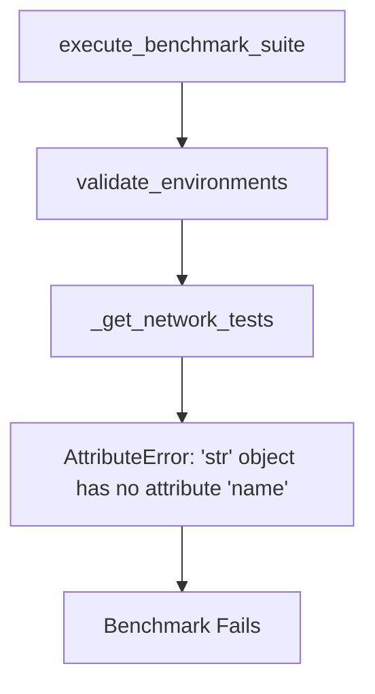
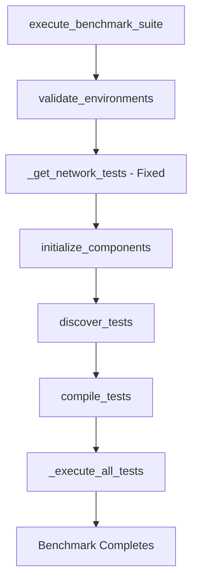

# Benchmark Error Fix Design

## Overview

This design addresses a critical bug in the multi-language benchmark orchestrator that causes the error "'str' object has no attribute 'name'" during benchmark execution. The error occurs in the `_get_network_tests()` method when attempting to access a `.name` attribute on string objects returned by `get_enabled_test_suites()`.

## Error Analysis

### Root Cause
The error occurs in `src/orchestrator/core.py` at line 181:

```python
if suite_name in [ts.name for ts in self.config.get_enabled_test_suites()]:
```

### Issue Description
- `self.config.get_enabled_test_suites()` returns a `List[str]` containing test suite names
- The code incorrectly assumes it returns objects with a `.name` attribute
- This causes an AttributeError when trying to access `.name` on string objects

### Impact
- Prevents benchmark execution from proceeding beyond environment validation
- Affects all benchmark runs when network-dependent test suites are enabled
- Blocks the orchestrator initialization process

## Technical Architecture

### Current Flow


### Fixed Flow


## Bug Fix Implementation

### Code Changes Required

#### File: `src/orchestrator/core.py`

**Problem Method:**
```python
def _get_network_tests(self) -> List[str]:
    """Get list of network-dependent test suites."""
    network_suites = []
    for suite_name, suite_config in self.config.test_suites.items():
        if hasattr(suite_config, 'requires_network') and suite_config.requires_network:
            if suite_name in [ts.name for ts in self.config.get_enabled_test_suites()]:  # ❌ BUG HERE
                network_suites.append(suite_name)
    return network_suites
```

**Fixed Method:**
```python
def _get_network_tests(self) -> List[str]:
    """Get list of network-dependent test suites."""
    network_suites = []
    enabled_test_suites = self.config.get_enabled_test_suites()
    
    for suite_name, suite_config in self.config.test_suites.items():
        if hasattr(suite_config, 'requires_network') and suite_config.requires_network:
            if suite_name in enabled_test_suites:  # ✅ FIXED: Direct string comparison
                network_suites.append(suite_name)
    return network_suites
```

### Change Analysis

| Aspect | Before | After |
|--------|--------|-------|
| Return Type | `get_enabled_test_suites()` returns `List[str]` | Same - no change needed |
| Comparison Logic | `[ts.name for ts in list_of_strings]` | Direct string-to-list comparison |
| Error Handling | Throws AttributeError | Works correctly |
| Performance | O(n²) due to list comprehension | O(n) with direct lookup |

## Validation Strategy

### Unit Testing
```python
def test_get_network_tests_fix():
    """Test that _get_network_tests works with string suite names."""
    config = BenchmarkConfig("test_config.json")
    orchestrator = BenchmarkOrchestrator(config)
    
    # Should not throw AttributeError
    network_tests = orchestrator._get_network_tests()
    
    # Should return list of network-dependent suite names
    assert isinstance(network_tests, list)
    for test_name in network_tests:
        assert isinstance(test_name, str)
```

### Integration Testing
- Execute complete benchmark run with network test suites enabled
- Verify environment validation passes without errors
- Confirm orchestrator proceeds to component initialization

### Error Reproduction
```bash
# Command that reproduces the error:
python bench_orchestrator.py run

# Expected behavior after fix:
# ✅ Environment validation completes
# ✅ Component initialization proceeds
# ✅ Benchmark execution starts
```

## Network Test Suite Configuration

The benchmark system includes network-dependent test suites that require special handling:

```json
{
  "network_operations": {
    "enabled": true,
    "timeout": 60,
    "iterations": 5,
    "tests": ["ping_test", "http_request", "dns_lookup"],
    "requires_network": true
  }
}
```

### Network Validation Impact
- The `_get_network_tests()` method identifies suites requiring network connectivity
- Environment validator checks network availability for these suites
- Fixed method ensures proper identification of network-dependent suites

## Testing Approach

### Pre-Fix Verification
1. Reproduce error with current codebase
2. Confirm error occurs at line 181 in `core.py`
3. Verify error message matches: "'str' object has no attribute 'name'"

### Post-Fix Validation
1. Apply code fix to `_get_network_tests()` method
2. Execute benchmark with network test suites enabled
3. Verify successful progression through all benchmark phases:
   - Environment validation ✅
   - Component initialization ✅
   - Test discovery ✅
   - Compilation ✅
   - Execution ✅

### Edge Cases
- Configuration with no network test suites
- All test suites disabled
- Mixed enabled/disabled network suites
- Invalid network configurations

## Risk Assessment

### Low Risk Change
- **Scope**: Single method modification
- **Impact**: Fixes blocking error without affecting functionality
- **Backward Compatibility**: Fully maintained
- **Dependencies**: No external dependency changes

### Change Validation
- Simple string comparison logic
- No data structure modifications
- Preserves existing API contracts
- Maintains configuration compatibility

## Configuration Dependencies

The fix relies on existing configuration structure:

### Test Suite Structure
```typescript
interface TestSuiteConfig {
  enabled: boolean;
  timeout: number;
  iterations: number;
  tests: string[];
  requires_network?: boolean;  // Optional flag for network dependencies
}
```

### Method Dependencies
- `config.get_enabled_test_suites()` → Returns `List[str]`
- `config.test_suites` → Returns `Dict[str, TestSuiteConfig]`
- `hasattr(suite_config, 'requires_network')` → Checks for network flag

## Implementation Steps

1. **Backup Current Code**
   - Create backup of `src/orchestrator/core.py`

2. **Apply Fix**
   - Modify `_get_network_tests()` method
   - Remove erroneous `.name` attribute access
   - Use direct string comparison

3. **Test Fix**
   - Run benchmark command to verify error resolution
   - Execute full benchmark suite for integration testing

4. **Validate Functionality**
   - Confirm network test suite detection works correctly
   - Verify environment validation completes successfully