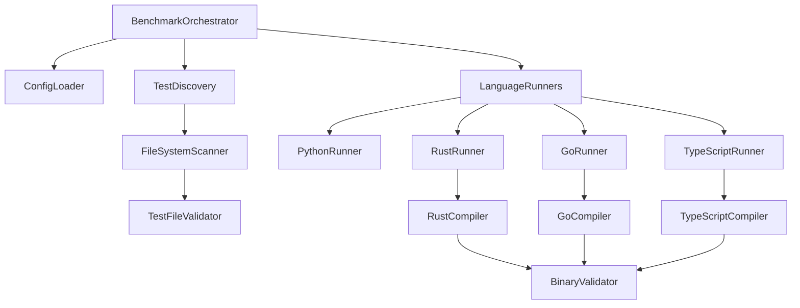
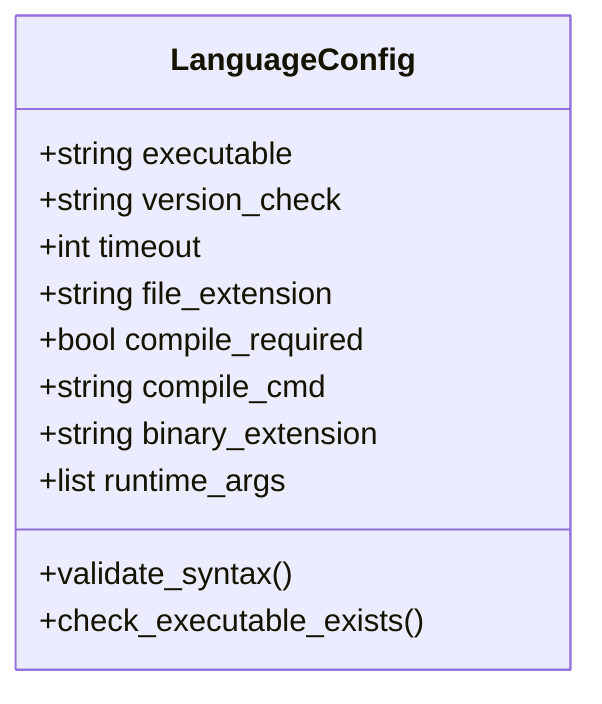
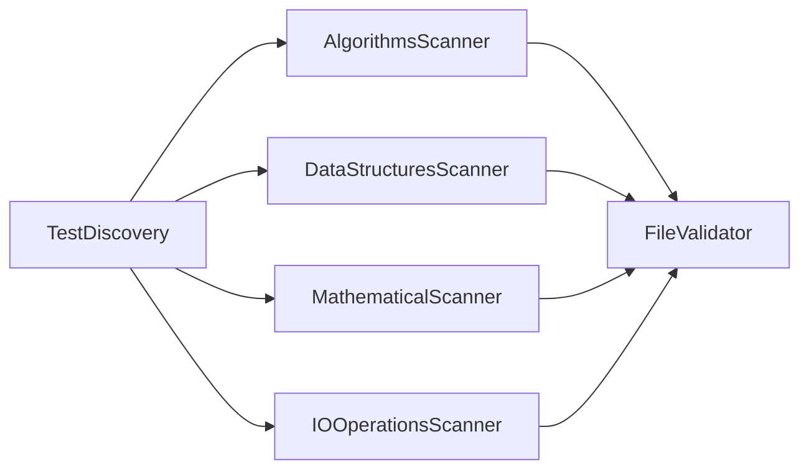
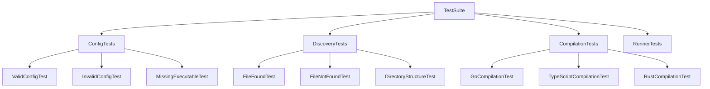
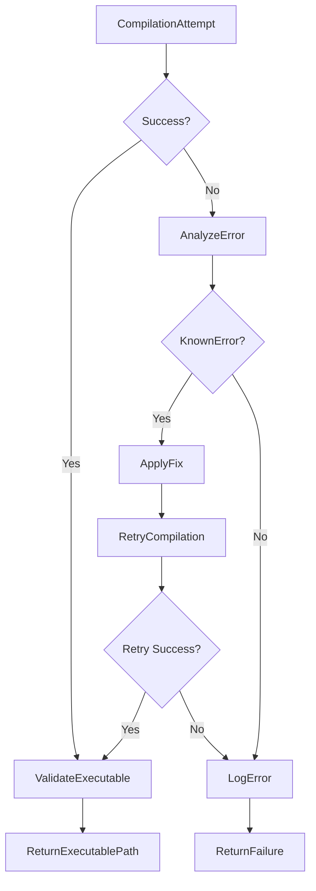

# Benchmark Orchestrator Fix Design

## Overview

This design addresses critical issues in the multi-language benchmark orchestrator that prevent proper test execution. The main problems identified include test file discovery failures, Go compilation errors due to malformed ldflags syntax, TypeScript compilation issues, and missing test files causing execution failures.

## Technology Stack & Dependencies

- **Core Language**: Python 3.8+
- **Supported Test Languages**: Python, Rust, Go, TypeScript
- **Build Tools**: rustc, go build, tsc, node
- **Process Management**: subprocess, psutil
- **Configuration**: JSON-based configuration system

## Problem Analysis

### Critical Issues Identified

1. **Test File Discovery Errors**
   - Pattern: `pi_calculation..py` (double dots) causing file not found errors
   - Root cause: File extension string formatting issue in configuration parsing

2. **Go Compilation Failure** 
   - Error: `invalid value "\"-s" for flag -ldflags: missing =<value>`
   - Root cause: Malformed ldflags syntax in configuration

3. **TypeScript Compilation Failure**
   - Error: `Le fichier spécifié est introuvable` (File not found)
   - Root cause: Missing TypeScript compiler (tsc) executable check

4. **Missing Test Files**
   - Only fibonacci test exists in `tests/algorithms/fibonacci/`
   - Other expected tests missing from test directories

## Architecture

### Component Interaction Flow



### Configuration Data Model

| Component | Current Issue | Fixed Implementation |
|-----------|---------------|---------------------|
| Language Config | Double dots in extensions | Proper extension parsing |
| Go Compile Command | Malformed ldflags | Corrected syntax |
| Test Discovery | Hardcoded paths | Dynamic directory scanning |
| TypeScript Compiler | Missing executable check | Runtime validation |

## Component Architecture

### 1. Configuration System Enhancement

**BenchmarkConfig Class**
- Fix file extension parsing to prevent double dots
- Validate compile commands during initialization
- Add runtime executable validation for all languages

**Language Configuration Structure**


### 2. Test Discovery Engine

**TestDiscoveryService**
- Scan multiple directory structures dynamically
- Validate file existence before adding to test registry
- Support configurable test directory patterns
- Handle missing test files gracefully

**Directory Scanning Strategy**


### 3. Compilation System Fixes

**GoRunner Compilation Fix**
- Current: `go build -ldflags=\"-s -w\" -o {output} {source}`
- Fixed: `go build -ldflags="-s -w" -o {output} {source}`

**TypeScriptRunner Enhancement**
- Add TypeScript compiler availability check
- Implement fallback compilation strategies
- Improve error reporting for missing dependencies

**Compilation Validation Pipeline**
```mermaid
sequenceDigram
    participant O as Orchestrator
    participant R as Runner
    participant C as Compiler
    participant V as Validator
    
    O->>R: compile_test(source_file)
    R->>R: validate_source_exists()
    R->>C: execute_compile_command()
    C->>V: check_output_exists()
    V->>R: return_compilation_result()
    R->>O: return_executable_path()
```

## Testing Strategy

### Unit Testing Framework

**Test Coverage Areas**
- Configuration parsing and validation
- Test file discovery mechanisms
- Compilation command generation
- Error handling for missing files
- Language runner initialization

**Mock Strategy**
- Mock subprocess calls for compilation testing
- Mock file system operations for discovery testing
- Mock configuration loading for validation testing

**Test Structure**


## Implementation Details

### Configuration System Updates

**File Extension Parsing**
- Remove duplicate extension concatenation
- Validate extension format during configuration loading
- Add configuration validation tests

**Compile Command Validation**
- Syntax validation for shell command formatting
- Platform-specific command generation
- Error recovery for malformed commands

### Test Discovery Improvements

**Dynamic Directory Scanning**
- Configurable test directory patterns
- Recursive file discovery with depth limits
- File existence validation before test registration

**Missing Test Handling**
- Graceful degradation when tests are missing
- Warning messages with suggested actions
- Ability to run partial test suites

### Compilation System Enhancements

**Error Recovery Mechanisms**
- Retry compilation with alternative flags
- Fallback to basic compilation without optimizations
- Detailed error reporting with suggested fixes

**Executable Validation**
- Post-compilation existence checks
- Permission validation for generated binaries
- Size and metadata validation

## Error Handling & Recovery

### Compilation Error Recovery



### Test Discovery Fallbacks

- Continue execution with available tests when some are missing
- Provide detailed missing test reports
- Suggest test file creation or configuration updates

### Runtime Error Handling

- Timeout management for long-running compilations
- Resource cleanup on failure
- Graceful degradation of benchmark suite execution

## Validation & Monitoring

### Pre-execution Validation

**Environment Checks**
- Verify all required compilers are installed
- Validate configuration syntax
- Test compilation with dummy files

**Runtime Monitoring**
- Track compilation success rates
- Monitor execution timeouts
- Log resource usage during tests

### Post-execution Analysis

**Result Validation**
- Verify benchmark result completeness
- Identify patterns in test failures
- Generate improvement recommendations

## Configuration Updates Required

### bench.config.json Fixes

```json
{
  "languages": {
    "go": {
      "compile_cmd": "go build -ldflags=\"-s -w\" -o {output} {source}"
    }
  }
}
```

**Should be changed to:**

```json
{
  "languages": {
    "go": {
      "compile_cmd": "go build -ldflags=-s -ldflags=-w -o {output} {source}"
    }
  }
}
```

### TypeScript Configuration Enhancement

```json
{
  "languages": {
    "typescript": {
      "executable": "node",
      "compiler_executable": "tsc",
      "compile_cmd": "tsc {source} --outDir {output_dir} --target ES2020",
      "version_check": "--version",
      "compiler_check": "--version"
    }
  }
}
```