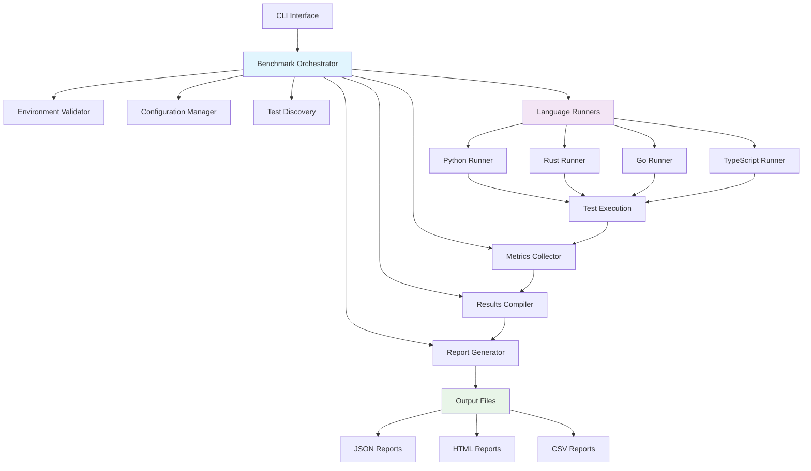
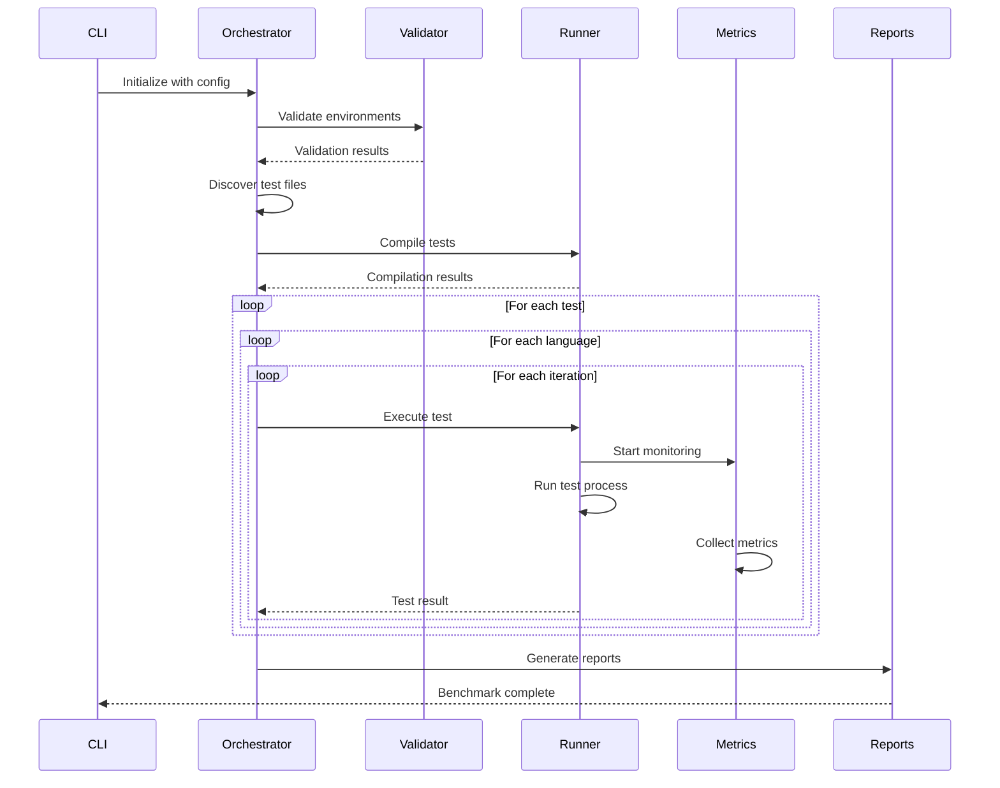
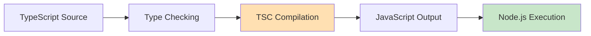
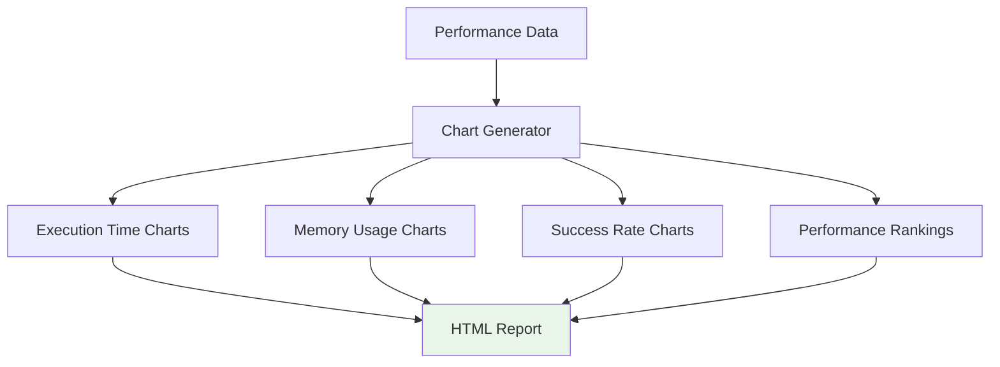

# Benchmark Orchestrator Design Document

## Overview

The Benchmark Orchestrator is a comprehensive multi-language performance benchmarking framework designed to evaluate and compare the execution performance of algorithms and data structures across different programming languages (Python, Rust, Go, TypeScript). The system provides standardized test execution, metrics collection, and automated reporting capabilities to facilitate objective performance analysis.

### Core Objectives
- **Cross-Language Performance Comparison**: Execute identical computational tasks across multiple programming languages
- **Standardized Metrics Collection**: Gather consistent performance metrics including execution time, memory usage, and CPU utilization
- **Automated Test Orchestration**: Manage compilation, execution, and result aggregation for diverse language ecosystems
- **Comprehensive Reporting**: Generate multi-format reports with statistical analysis and visualizations

## Architecture

### System Architecture Diagram



### Component Architecture

#### 1. Core Orchestrator (`core.py`)
- **Primary Responsibility**: Central coordination of benchmark execution workflow
- **Key Functions**:
  - Test suite initialization and configuration
  - Language environment validation
  - Execution flow orchestration
  - Results aggregation and analysis

#### 2. Language Runner System (`runners.py`)
- **Abstract Base Runner**: Defines common interface for all language implementations
- **Language-Specific Runners**: 
  - `PythonRunner`: Direct script execution
  - `RustRunner`: Cargo-based compilation and execution
  - `GoRunner`: Go module compilation and execution
  - `TypeScriptRunner`: TSC compilation and Node.js execution

#### 3. Configuration Management (`config.py`)
- **Test Suite Configuration**: Defines enabled test categories and parameters
- **Language Configuration**: Specifies compilation commands, timeouts, and runtime parameters
- **Performance Settings**: Configures iteration counts, timeout values, and sampling intervals

#### 4. Metrics Collection (`metrics.py`)
- **Process Monitoring**: Real-time tracking of CPU and memory usage during test execution
- **Performance Measurement**: High-precision timing and resource utilization capture
- **System Information**: Environment metadata collection for reproducible results

#### 5. Results Processing (`results.py`)
- **Statistical Analysis**: Calculation of mean, median, standard deviation for performance metrics
- **Comparative Analysis**: Cross-language performance ranking and efficiency metrics
- **Data Aggregation**: Consolidation of raw execution data into structured analysis results

#### 6. Report Generation (`reports.py`)
- **Multi-Format Output**: JSON, HTML, and CSV report generation
- **Data Visualization**: Chart generation for performance comparisons
- **Detailed Analytics**: Statistical summaries and performance trend analysis

## Test Suite Organization

### Test Categories

#### Algorithms
- **Binary Search**: Sorted array search performance
- **Quicksort**: Comparison-based sorting algorithm
- **Prime Sieve**: Computational mathematics performance
- **Fibonacci**: Recursive computation efficiency

#### Data Structures
- **Hash Table**: Key-value storage and retrieval operations
- **Binary Tree**: Tree traversal and manipulation
- **Linked List**: Sequential data structure operations

#### Mathematical Operations
- **Pi Calculation**: Floating-point computational intensity
- **Matrix Multiplication**: Linear algebra performance

#### I/O Operations
- **JSON Parsing**: Data serialization/deserialization performance
- **CSV Processing**: Structured data handling
- **Large File Reading**: File system I/O throughput

#### Network Operations
- **HTTP Requests**: Network communication performance
- **DNS Lookup**: Network resolution efficiency
- **Ping Test**: Network latency measurement

#### System Operations
- **Memory Allocation**: Dynamic memory management performance
- **Compression**: Data compression algorithm efficiency

### Test Execution Flow



## Language Compilation Strategy

### Rust Compilation


**Implementation Details**:
- Creates temporary Cargo projects for proper dependency management
- Automatically detects and includes external crates through Cargo.toml
- Uses release optimization flags for performance benchmarking
- Handles cleanup of temporary directories

### Go Compilation


**Implementation Details**:
- Initializes Go modules for proper import resolution
- Applies size optimization flags (`-s -w`)
- Handles cross-platform binary generation
- Manages module cleanup

### TypeScript Compilation


**Implementation Details**:
- Multi-method compilation fallback (tsc, npx tsc, local tools)
- Automatic @types/node dependency installation
- Windows subprocess error handling
- JavaScript runtime optimization

## Performance Metrics Collection

### Execution Metrics
- **Execution Time**: High-precision timing using `time.perf_counter()`
- **Memory Usage**: Peak memory consumption during test execution
- **CPU Utilization**: Average CPU usage percentage during execution
- **Success Rate**: Percentage of successful test iterations

### System Metrics
- **Environment Information**: Language versions, system specifications
- **Resource Utilization**: System-wide resource consumption during benchmarks
- **Compilation Metrics**: Compilation time and binary size for compiled languages

### Statistical Analysis
- **Central Tendency**: Mean, median execution times
- **Variability**: Standard deviation, coefficient of variation
- **Performance Rankings**: Comparative performance scoring across languages
- **Reliability Metrics**: Success rates and error frequency analysis

## Configuration System

### Test Suite Configuration Structure
```json
{
  "test_suites": {
    "algorithms": {
      "enabled": true,
      "timeout": 30,
      "iterations": 10,
      "tests": ["fibonacci", "quicksort", "binary_search", "prime_sieve"]
    }
  }
}
```

### Language Configuration Structure
```json
{
  "languages": {
    "rust": {
      "executable": "cargo",
      "compile_cmd": "cargo build --release",
      "timeout": 30,
      "file_extension": ".rs",
      "compile_required": true
    }
  }
}
```

## Error Handling and Validation

### Environment Validation
- **Language Runtime Detection**: Verify availability of required interpreters and compilers
- **Network Connectivity Validation**: Test network access for network-dependent benchmarks
- **Dependency Verification**: Ensure required libraries and tools are installed

### Compilation Error Management
- **Dependency Resolution**: Automatic detection and installation of missing dependencies
- **Cross-Platform Compatibility**: Platform-specific compilation flag handling
- **Error Recovery**: Graceful handling of compilation failures with detailed error reporting

### Runtime Error Handling
- **Timeout Management**: Configurable timeout enforcement for test execution
- **Resource Monitoring**: Memory and CPU usage bounds checking
- **Process Isolation**: Secure test execution with proper cleanup

## Reporting and Output

### Report Format Specifications

#### JSON Report Structure
```json
{
  "benchmark_id": "bench_20250827_115837",
  "timestamp": "2025-01-27T11:58:37",
  "results": {
    "test_name": {
      "language_performances": {
        "python": {
          "avg_time": 988.65,
          "success_rate": 100.0
        }
      }
    }
  }
}
```

#### HTML Report Features
- **Interactive Charts**: Performance comparison visualizations using Plotly
- **Statistical Tables**: Detailed performance metrics with sorting capabilities
- **Executive Summary**: High-level performance rankings and insights
- **Test Details**: Individual test results with error information

#### CSV Export Capabilities
- **Comprehensive Data Export**: Raw performance data for external analysis
- **Ranking Tables**: Language performance rankings by category
- **Statistical Summaries**: Aggregated performance metrics

### Visualization Components


## Extensibility and Maintenance

### Adding New Languages
1. **Runner Implementation**: Create new language-specific runner class extending `BaseLanguageRunner`
2. **Configuration Addition**: Add language configuration to `bench.config.json`
3. **Test Implementation**: Implement test algorithms in the new language
4. **Validation Integration**: Add environment validation for the new language

### Adding New Test Categories
1. **Test Suite Definition**: Define new test category in configuration
2. **Multi-Language Implementation**: Implement tests across all supported languages
3. **Input Data Specification**: Create standardized input data files
4. **Integration Testing**: Validate test execution across all languages

### Performance Optimization
- **Parallel Execution**: Future enhancement for concurrent test execution
- **Caching System**: Compilation result caching for repeated test runs
- **Resource Pool Management**: Efficient resource allocation for large test suites
- **Incremental Analysis**: Support for partial benchmark execution and result merging

## Testing Strategy

### Validation Testing
- **Environment Validation Tests**: Verify correct detection of language runtimes and tools
- **Configuration Validation**: Test configuration parsing and validation logic
- **Network Connectivity Tests**: Validate network requirement detection and testing

### Integration Testing
- **End-to-End Workflow Tests**: Complete benchmark execution validation
- **Multi-Language Compilation Tests**: Verify successful compilation across all languages
- **Report Generation Tests**: Validate accuracy and completeness of generated reports

### Performance Testing
- **Benchmark Accuracy Validation**: Verify consistent and accurate performance measurement
- **Resource Usage Monitoring**: Test metrics collection accuracy and overhead
- **Scalability Testing**: Validate performance with large test suites and multiple iterations