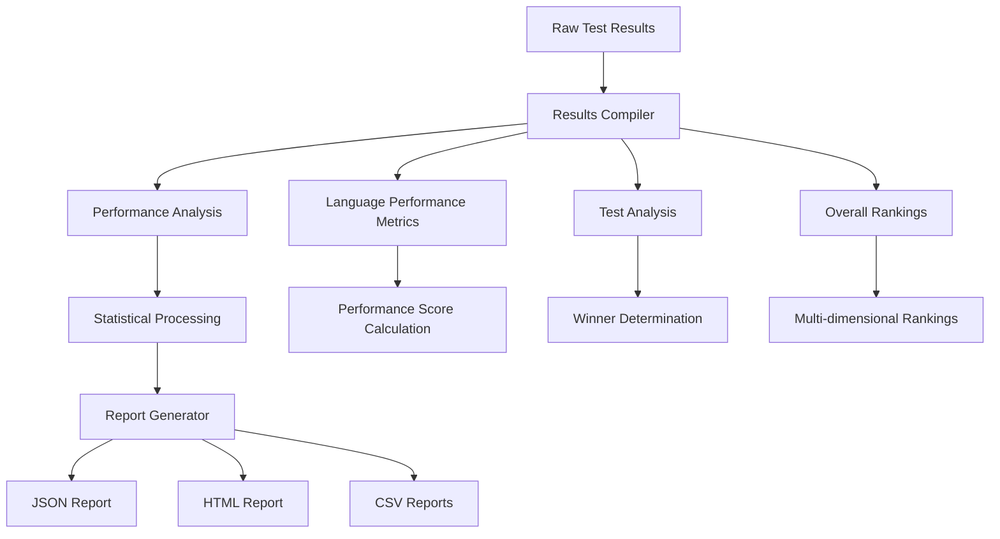
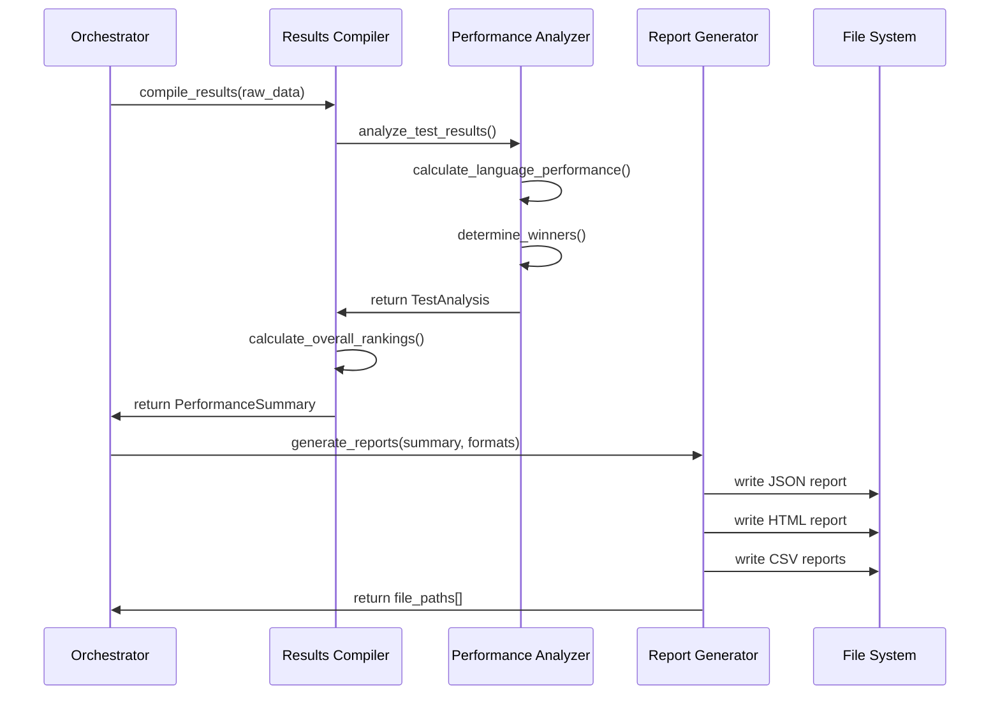
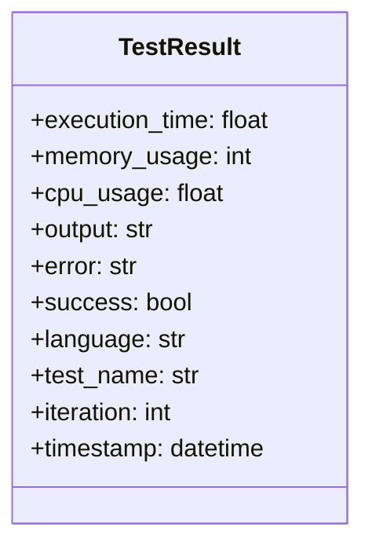
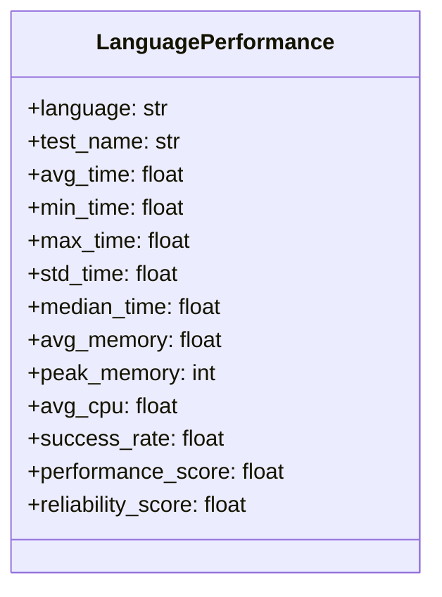
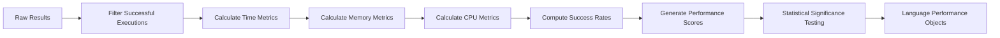
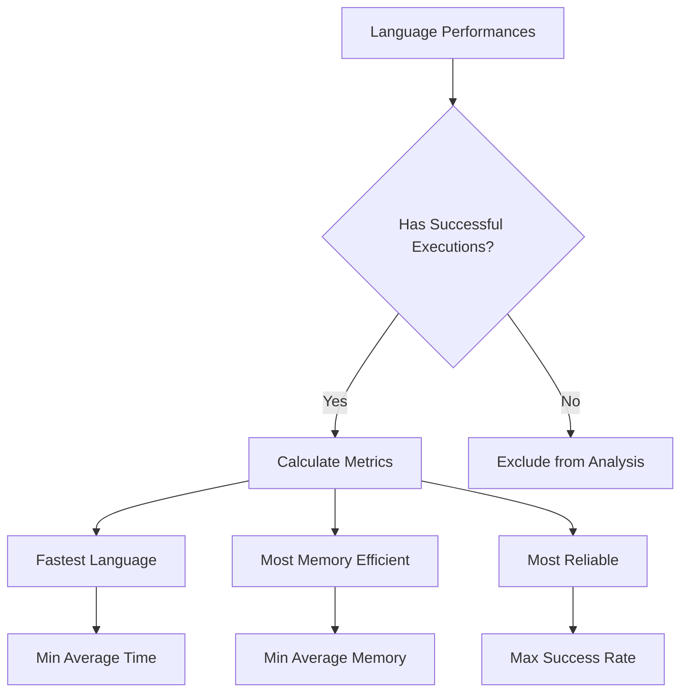
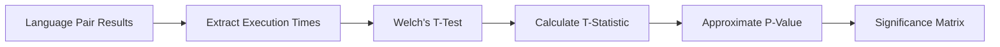
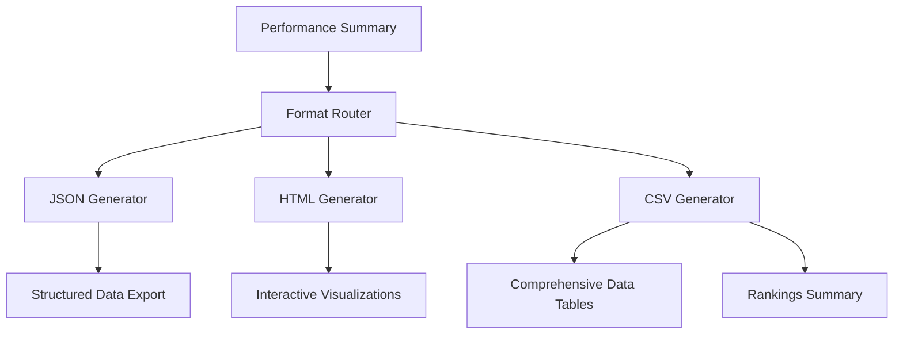
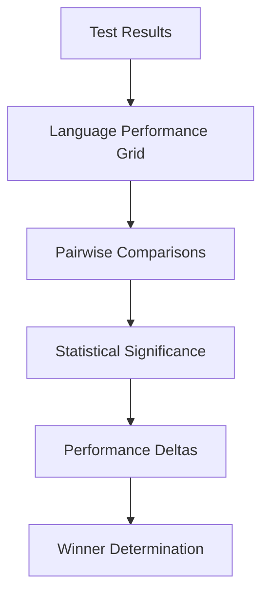
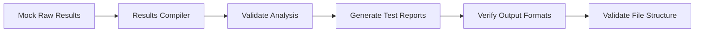

# Benchmark Results System Design

## Overview

The benchmark results system is a comprehensive performance analysis and reporting component of a multi-language benchmarking tool. It processes raw execution data from Python, Rust, Go, and TypeScript benchmark tests, compiles statistical analyses, and generates multiple output formats including JSON, HTML, and CSV reports.

**Core Purpose**: Transform raw benchmark execution data into actionable performance insights through statistical analysis, language comparisons, and visual reporting.

**Key Capabilities**:
- Multi-dimensional performance analysis (execution time, memory usage, reliability)
- Statistical significance testing between language implementations
- Comprehensive ranking systems across multiple performance metrics
- Multi-format report generation with visualizations

## Architecture

### Component Architecture



### Data Flow Architecture



### Core Data Models

#### TestResult


#### LanguagePerformance


## Results Compilation Engine

### Statistical Analysis Pipeline



### Performance Scoring Algorithm

The system employs a weighted composite scoring methodology:

| Metric | Weight | Calculation Method |
|--------|--------|-------------------|
| Execution Time | 70% | `1000.0 / (avg_time_ms)` |
| Memory Usage | 20% | `100.0 / max(avg_memory_mb, 1.0)` |
| Reliability | 10% | `success_rate * 100` |

### Winner Determination Logic



## Ranking Systems

### Multi-Dimensional Rankings

The system generates four distinct ranking categories:

#### Speed Rankings
- **Metric**: Average execution time across all tests
- **Calculation**: `1000.0 / (avg_time_ms)`
- **Higher scores indicate faster performance**

#### Memory Efficiency Rankings  
- **Metric**: Average memory consumption
- **Calculation**: `100.0 / max(avg_memory_mb, 1.0)`
- **Higher scores indicate lower memory usage**

#### Reliability Rankings
- **Metric**: Combined success rate and consistency
- **Calculation**: `(success_rate * 0.8) + (consistency_score * 0.2)`
- **Consistency based on standard deviation of execution times**

#### Overall Rankings
- **Metric**: Weighted composite of all performance dimensions
- **Combines speed, memory efficiency, and reliability scores**

### Statistical Significance Testing



**T-Test Implementation**:
- Uses Welch's t-test for unequal variances
- Calculates pooled standard error
- Generates p-values for pairwise language comparisons

## Report Generation System

### Output Format Architecture



### JSON Report Structure

```
{
  "benchmark_info": {
    "benchmark_id": "bench_YYYYMMDD_HHMMSS",
    "timestamp": "ISO8601",
    "execution_time": "seconds",
    "total_tests": "count",
    "total_languages": "count", 
    "total_executions": "count"
  },
  "test_results": {
    "test_name": {
      "fastest_language": "language",
      "most_memory_efficient": "language",
      "most_reliable": "language",
      "performance_ranking": [["language", score]],
      "language_performances": {
        "language": {
          "time_metrics": {},
          "memory_metrics": {},
          "reliability_metrics": {}
        }
      }
    }
  },
  "overall_rankings": {
    "by_speed": [["language", score]],
    "by_memory": [["language", score]],
    "by_reliability": [["language", score]],
    "by_overall": [["language", score]]
  }
}
```

### HTML Report Features

| Component | Description |
|-----------|-------------|
| Executive Summary | High-level performance overview with key metrics |
| Interactive Charts | Plotly-based visualizations for performance comparisons |
| Language Profiles | Detailed breakdown per programming language |
| Test Analysis | Individual test performance with statistical insights |
| System Information | Hardware and software environment details |

### CSV Export Formats

#### Comprehensive Results CSV
- **Columns**: Test, Language, Avg_Time, Memory, CPU, Success_Rate, Performance_Score
- **Purpose**: Detailed raw data for external analysis tools

#### Rankings Summary CSV  
- **Columns**: Language, Speed_Rank, Memory_Rank, Reliability_Rank, Overall_Rank
- **Purpose**: Simplified comparative analysis

## Performance Analysis Features

### Cross-Language Comparison Matrix



### Reliability Assessment

| Metric | Calculation | Purpose |
|--------|-------------|---------|
| Success Rate | `successful_runs / total_runs` | Execution stability |
| Consistency Score | `1.0 / (1.0 + std_deviation)` | Performance predictability |
| Reliability Index | `(success_rate * 0.8) + (consistency * 0.2)` | Combined reliability measure |

### Memory Profiling Integration

The system processes memory usage data at multiple levels:
- **Peak Memory**: Maximum memory consumption during execution
- **Average Memory**: Mean memory usage across successful runs  
- **Memory Efficiency**: Normalized score for cross-language comparison

## Testing Strategy

### Unit Testing Coverage

| Component | Test Focus |
|-----------|------------|
| Results Compiler | Statistical calculation accuracy |
| Performance Analyzer | Winner determination logic |
| Report Generator | Output format validation |
| Ranking Calculator | Score normalization correctness |

### Integration Testing



### Performance Testing Scenarios

- **Large Dataset Processing**: 1000+ test executions across 10+ languages
- **Report Generation Performance**: Sub-second generation for standard datasets
- **Memory Usage Validation**: Compiler memory footprint under load conditions