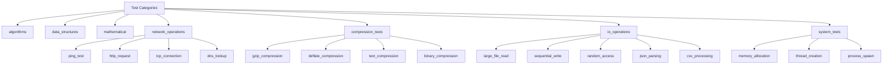
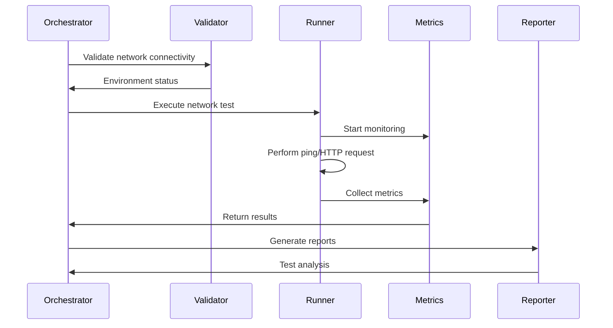

# New Test Categories Implementation Design

## Overview

This design document outlines the implementation of new test categories for the multi-language benchmark tool, expanding beyond the current algorithmic, data structure, and mathematical tests to include network operations, compression algorithms, file I/O performance, and other system-level benchmarks.

## Technology Stack & Dependencies

The benchmark tool uses a Python-based orchestrator with multi-language support:
- **Core**: Python 3.8+ orchestrator
- **Supported Languages**: Python, Rust, Go, TypeScript
- **New Dependencies**: 
  - Network testing: `requests`, `aiohttp` (Python), `reqwest` (Rust), `net/http` (Go), `axios` (TypeScript)
  - Compression: `gzip`, `zlib` (built-in), `flate2` (Rust), `compress/gzip` (Go)
  - File I/O: Standard library file operations across languages

## Architecture

### Test Category Structure



### Test Configuration Schema

| Test Category | Description | Timeout | Iterations | Resource Requirements |
|---------------|-------------|---------|------------|----------------------|
| network_operations | Network connectivity and protocol tests | 60s | 5 | Internet connection |
| compression_tests | Data compression algorithm performance | 30s | 10 | Memory for test data |
| io_operations | File system and data processing tests | 45s | 8 | Disk space (100MB+) |
| system_tests | System-level resource management tests | 40s | 6 | OS process permissions |

## Component Architecture

### Test File Organization

Each new test category follows the established pattern:

```
tests/
├── network_operations/
│   ├── ping_test/
│   │   ├── ping_test.py
│   │   ├── ping_test.rs
│   │   ├── ping_test.go
│   │   ├── ping_test.ts
│   │   └── input.json
│   ├── http_request/
│   └── dns_lookup/
├── compression_tests/
│   ├── gzip_compression/
│   ├── text_compression/
│   └── binary_compression/
├── io_operations/
│   ├── large_file_read/
│   ├── json_parsing/
│   └── csv_processing/
└── system_tests/
    ├── memory_allocation/
    └── thread_creation/
```

### Configuration Extension

Update `bench.config.json` with new test suites:

```json
{
  "test_suites": {
    "network_operations": {
      "enabled": true,
      "timeout": 60,
      "iterations": 5,
      "tests": ["ping_test", "http_request", "dns_lookup", "tcp_connection"],
      "requires_network": true
    },
    "compression_tests": {
      "enabled": true,
      "timeout": 30,
      "iterations": 10,
      "tests": ["gzip_compression", "deflate_compression", "text_compression"],
      "test_data_size": "10MB"
    },
    "io_operations": {
      "enabled": true,
      "timeout": 45,
      "iterations": 8,
      "tests": ["large_file_read", "sequential_write", "json_parsing", "csv_processing"],
      "test_file_size": "50MB"
    },
    "system_tests": {
      "enabled": true,
      "timeout": 40,
      "iterations": 6,
      "tests": ["memory_allocation", "thread_creation", "process_spawn"]
    }
  }
}
```

## Test Implementation Details

### Network Operations Tests

#### Ping Test
- **Purpose**: Measure network latency and connectivity
- **Input**: Target URLs/IPs with packet count
- **Metrics**: Average latency, packet loss, jitter
- **Implementation**: ICMP ping or HTTP HEAD requests

```json
{
  "test_name": "ping_test",
  "description": "Network latency measurement",
  "parameters": {
    "targets": ["8.8.8.8", "cloudflare.com", "github.com"],
    "packet_count": 10,
    "timeout": 5
  },
  "expected_metrics": ["avg_latency", "packet_loss", "jitter"],
  "category": "network_operations"
}
```

#### HTTP Request Test
- **Purpose**: Measure HTTP request/response performance
- **Input**: URL endpoints with various payload sizes
- **Metrics**: Response time, throughput, success rate

#### DNS Lookup Test
- **Purpose**: Measure DNS resolution performance
- **Input**: Domain names for resolution
- **Metrics**: Resolution time, cache hit rate

### Compression Tests

#### GZIP Compression Test
- **Purpose**: Evaluate compression algorithm performance
- **Input**: Various data types (text, binary, JSON)
- **Metrics**: Compression ratio, compression time, decompression time

```json
{
  "test_name": "gzip_compression",
  "description": "GZIP compression performance benchmark",
  "parameters": {
    "input_sizes": [1024, 10240, 102400],
    "data_types": ["text", "binary", "json"],
    "compression_levels": [1, 6, 9]
  },
  "expected_metrics": ["compression_ratio", "compression_time", "decompression_time"],
  "category": "compression_tests"
}
```

#### Text Compression Test
- **Purpose**: Specialized text compression evaluation
- **Input**: Various text formats (plain text, code, markup)
- **Metrics**: Text-specific compression efficiency

### I/O Operations Tests

#### Large File Read Test
- **Purpose**: Measure file reading performance with large datasets
- **Input**: File sizes from 10MB to 100MB
- **Metrics**: Read throughput, memory usage, buffer efficiency

```json
{
  "test_name": "large_file_read",
  "description": "Large file sequential reading benchmark",
  "parameters": {
    "file_sizes": [10485760, 52428800, 104857600],
    "buffer_sizes": [4096, 65536, 1048576],
    "read_patterns": ["sequential", "chunked"]
  },
  "expected_metrics": ["read_throughput", "memory_efficiency", "io_wait_time"],
  "category": "io_operations"
}
```

#### JSON Parsing Test
- **Purpose**: Evaluate JSON processing performance
- **Input**: JSON files of varying complexity and size
- **Metrics**: Parse time, memory usage, object creation overhead

#### CSV Processing Test
- **Purpose**: Measure structured data processing performance
- **Input**: CSV files with different column counts and row counts
- **Metrics**: Processing time, memory usage, data validation overhead

### System Tests

#### Memory Allocation Test
- **Purpose**: Evaluate memory management performance
- **Input**: Various allocation patterns and sizes
- **Metrics**: Allocation speed, deallocation speed, fragmentation

#### Thread Creation Test
- **Purpose**: Measure concurrent execution capabilities
- **Input**: Thread count and workload distribution
- **Metrics**: Thread creation time, synchronization overhead, scalability

## Data Flow Architecture



## Testing Strategy

### Unit Tests
- Test data generation utilities
- Network connectivity validation
- Compression algorithm correctness
- File I/O error handling

### Integration Tests
- End-to-end test execution
- Cross-language result consistency
- Performance regression detection
- Resource cleanup validation

### Performance Validation
- Baseline performance establishment
- Language-specific optimization validation
- Memory leak detection
- Network timeout handling

## Implementation Phases

### Phase 1: Foundation
1. Extend configuration schema for new test categories
2. Implement test data generation utilities
3. Add network connectivity validation
4. Create base test file templates

### Phase 2: Network Operations
1. Implement ping test across all languages
2. Add HTTP request benchmarking
3. Implement DNS lookup performance testing
4. Add TCP connection establishment tests

### Phase 3: Compression & I/O
1. Implement GZIP compression tests
2. Add large file I/O benchmarks
3. Implement JSON/CSV processing tests
4. Add text compression specializations

### Phase 4: System Tests
1. Implement memory allocation benchmarks
2. Add thread creation performance tests
3. Implement process spawning tests
4. Add resource monitoring enhancements

### Phase 5: Integration & Optimization
1. Integrate all new tests into orchestrator
2. Optimize cross-language consistency
3. Add specialized reporting for new metrics
4. Performance tuning and validation

## Resource Requirements

### Test Data Generation
- Generate test files of various sizes (1KB to 100MB)
- Create network endpoints for testing (mock servers)
- Prepare sample datasets for compression testing
- Generate structured data for parsing tests

### Network Resources
- External connectivity for ping tests
- HTTP endpoint availability
- DNS server responsiveness
- Firewall configuration for network tests

### Storage Requirements
- Temporary file storage (up to 500MB)
- Test result archival space
- Binary compilation artifacts
- Performance baseline data

## Error Handling & Resilience

### Network Failures
- Timeout handling for network operations
- Graceful degradation when offline
- Retry mechanisms for transient failures
- Alternative endpoint fallbacks

### Resource Constraints
- Memory limit detection and handling
- Disk space validation before large file tests
- CPU throttling awareness
- Concurrent execution limits

### Cross-Language Compatibility
- Standard error codes across languages
- Consistent metric reporting formats
- Unicode handling for text processing
- Platform-specific optimizations

This design provides a comprehensive framework for extending the benchmark tool with practical, real-world performance tests that will give users insights into language performance across network, I/O, and system-level operations.