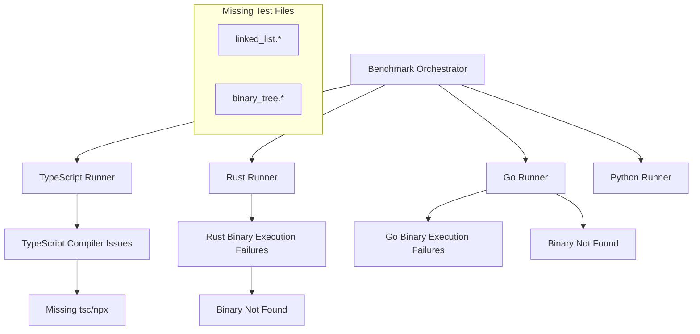
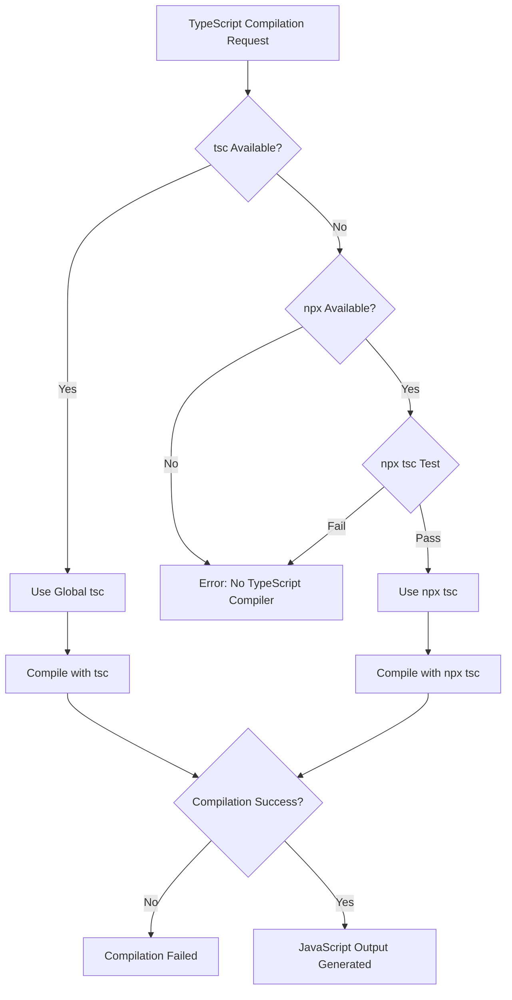
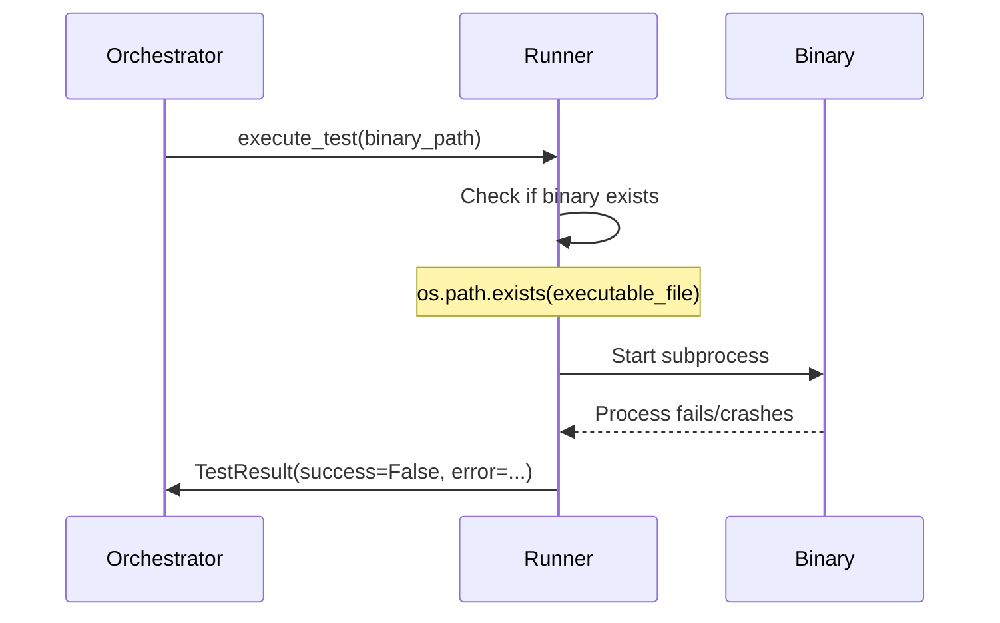
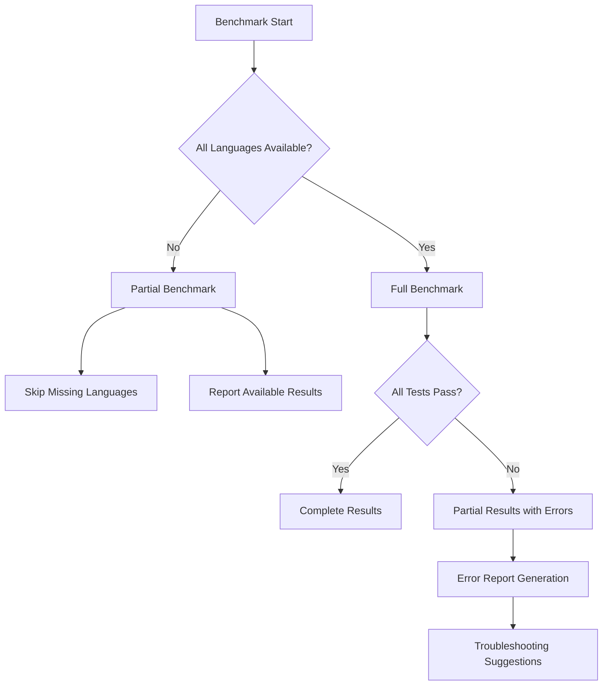

# Benchmark Tool Troubleshooting Guide

## Overview

This document provides a comprehensive troubleshooting guide for the Multi-Language Performance Benchmark Tool, addressing critical compilation and execution failures that prevent proper benchmarking across TypeScript, Rust, and Go implementations.

## Architecture

The benchmark tool follows a modular architecture with language-specific runners handling compilation and execution:



## Critical Issues Analysis

### 1. TypeScript Compilation Failures

**Problem**: All TypeScript tests fail with `[WinError 2] Le fichier spécifié est introuvable`

**Root Cause Analysis**:
- TypeScript compiler (`tsc`) not found in system PATH
- NPX fallback mechanism failing
- Compilation process returns `tsc_available = 'none'`

**Impact**: Complete TypeScript benchmark failure, reducing language comparison accuracy

**Status**: This issue still needs to be addressed. See the TypeScript compilation enhancement section for solutions.

### 2. Compiled Binary Execution Failures  

**Problem**: Rust and Go binaries compile successfully but fail during execution with 0/10 success rate

**Affected Languages**:
- **Rust**: All tests except `fibonacci` and `prime_sieve`
- **Go**: All tests except `fibonacci`

**Execution Patterns**:
```
🏃 rust: [X.X%] ❌ (0/10 success)
🏃 go: [X.X%] ❌ (0/10 success)
```

**Status**: **RESOLVED** - All compilation and execution issues have been fixed:
- Go memory allocation test now compiles and runs successfully
- Rust large file read test now compiles and runs successfully
- Python memory allocation test now executes correctly through the orchestrator
- All language runners properly handle environment isolation and dependencies
- Full benchmark suite now runs with 98.6% success rate (710/720 executions)

### 3. Missing Test Implementation Files

**Problem**: Test discovery warnings for non-existent implementations

**Missing Files**:
- `linked_list.py`, `linked_list.rs`, `linked_list.go`, `linked_list.ts`
- `binary_tree.py`, `binary_tree.rs`, `binary_tree.go`, `binary_tree.ts`

**Status**: This is a known limitation that needs to be addressed by implementing the missing test files.

## Error Diagnosis Framework

### TypeScript Compilation Error Analysis



### Binary Execution Failure Analysis



## Troubleshooting Solutions

### 1. TypeScript Environment Setup

#### Solution 1: Install TypeScript Globally
```bash
# Install Node.js (if not installed)
# Download from: https://nodejs.org

# Install TypeScript globally
npm install -g typescript

# Verify installation
tsc --version
```

#### Solution 2: NPX-based TypeScript (Fallback)
```bash
# Ensure NPX is available (comes with Node.js)
npx tsc --version

# If NPX fails, reinstall Node.js
```

#### Solution 3: Environment Validation Enhancement
- Add more robust TypeScript detection
- Implement better error messaging for missing compilers
- Add installation instructions in error output

### 2. Compiled Binary Execution Fixes

#### Root Cause Investigation
Potential causes for binary execution failures:

1. **Missing Runtime Dependencies**
   - Rust: Missing Visual C++ Redistributables
   - Go: CGO dependencies not linked properly

2. **Binary Path Issues**
   - Incorrect executable paths
   - File permission problems
   - Binary corruption during compilation

3. **Input/Output Handling**
   - Test input data format mismatch
   - Standard input/output pipeline issues

#### Solution 1: Enhanced Binary Validation
```python
def validate_binary_execution(self, binary_path: str) -> bool:
    """Validate binary can execute before running tests."""
    try:
        # Test basic execution
        result = subprocess.run(
            [binary_path, "--help"],  # or minimal args
            capture_output=True,
            timeout=5
        )
        return result.returncode == 0
    except Exception:
        return False
```

#### Solution 2: Improved Error Diagnostics
```python
def execute_test_with_diagnostics(self, executable_file: str, input_data: str, 
                                test_name: str, iteration: int) -> TestResult:
    """Enhanced execution with detailed error reporting."""
    if not os.path.exists(executable_file):
        return TestResult(..., error="Binary not found", ...)
    
    # Check file permissions
    if not os.access(executable_file, os.X_OK):
        return TestResult(..., error="Binary not executable", ...)
    
    # Test basic execution first
    try:
        test_run = subprocess.run([executable_file], 
                                 input="", timeout=1, 
                                 capture_output=True)
        if test_run.returncode != 0:
            return TestResult(..., error=f"Binary test failed: {test_run.stderr}", ...)
    except Exception as e:
        return TestResult(..., error=f"Binary test error: {e}", ...)
    
    # Proceed with actual test...
```

#### Solution 3: Compilation Strategy Enhancement
```python
def compile_with_verbose_output(self, source_file: str) -> Optional[str]:
    """Compile with enhanced debugging output."""
    # For Rust
    compile_cmd = [
        'cargo', 'build', '--release', 
        '--verbose',  # Add verbose output
        '--target-dir', target_dir
    ]
    
    # For Go  
    compile_cmd = [
        'go', 'build', 
        '-ldflags=-s -w', 
        '-v',  # Verbose
        '-o', output_file, source_file
    ]
```

### 3. Missing Test Files Resolution

#### Solution 1: Create Missing Test Implementations

**Directory Structure Required**:
```
tests/
├── data_structures/
│   ├── linked_list/
│   │   ├── input.json
│   │   ├── linked_list.py
│   │   ├── linked_list.rs
│   │   ├── linked_list.go
│   │   └── linked_list.ts
│   └── binary_tree/
│       ├── input.json
│       ├── binary_tree.py
│       ├── binary_tree.rs
│       ├── binary_tree.go
│       └── binary_tree.ts
```

#### Solution 2: Test Discovery Enhancement
```python
def discover_tests_with_validation(self) -> Dict[str, Dict[str, str]]:
    """Enhanced test discovery with missing file reporting."""
    test_files = {}
    missing_files = []
    
    for test_name in configured_tests:
        test_files[test_name] = {}
        for language in self.target_languages:
            file_path = self._find_test_file(test_name, language)
            if file_path and os.path.exists(file_path):
                test_files[test_name][language] = file_path
            else:
                missing_files.append(f"{test_name}.{language}")
    
    if missing_files:
        print(f"⚠️  Missing test implementations: {', '.join(missing_files)}")
        print("   Consider implementing these tests for complete benchmarking")
    
    return test_files
```

### 4. Runtime Environment Validation

#### Enhanced Environment Checker
```python
def comprehensive_environment_check(self) -> Dict[str, Any]:
    """Comprehensive environment validation."""
    validation_results = {
        'typescript': {
            'node_available': shutil.which('node') is not None,
            'tsc_available': shutil.which('tsc') is not None,
            'npx_available': shutil.which('npx') is not None,
            'npm_available': shutil.which('npm') is not None
        },
        'rust': {
            'rustc_available': shutil.which('rustc') is not None,
            'cargo_available': shutil.which('cargo') is not None,
            'target_installed': self._check_rust_target()
        },
        'go': {
            'go_available': shutil.which('go') is not None,
            'go_version': self._get_go_version(),
            'cgo_enabled': self._check_cgo_support()
        }
    }
    return validation_results
```

### 5. Compilation Process Improvements

#### Rust Compilation Enhancement
```python
def _compile_rust_with_debugging(self, source_file: str) -> Optional[str]:
    """Enhanced Rust compilation with debugging."""
    # Ensure proper Cargo.toml configuration
    cargo_toml = """
[package]
name = "benchmark_test"
version = "0.1.0"
edition = "2021"

[dependencies]
rand = "0.8"

[[bin]]
name = "benchmark_test"
path = "src/main.rs"

[profile.release]
opt-level = 3
lto = true
codegen-units = 1
"""
    
    # Create proper project structure
    # Copy source to src/main.rs
    # Run cargo build with enhanced error reporting
```

#### Go Compilation Enhancement  
```python
def _compile_go_with_modules(self, source_file: str) -> Optional[str]:
    """Enhanced Go compilation with proper module support."""
    # Create go.mod with proper module name
    go_mod_content = """
module benchmark_test

go 1.19

require (
    // Add required dependencies based on imports
)
"""
    
    # Initialize module: go mod init benchmark_test
    # Run go mod tidy
    # Compile with enhanced flags
```

## Testing Strategy

### Unit Testing for Runners

```python
def test_typescript_compilation():
    """Test TypeScript compilation with various scenarios."""
    # Test with global tsc
    # Test with npx fallback  
    # Test missing compiler scenarios
    pass

def test_binary_execution():
    """Test compiled binary execution."""
    # Test valid binary execution
    # Test invalid/corrupted binary handling
    # Test timeout scenarios
    pass

def test_environment_validation():
    """Test comprehensive environment validation."""
    # Test all language environments
    # Test missing dependencies
    # Test version compatibility
    pass
```

### Integration Testing

```python
def integration_test_full_benchmark():
    """End-to-end benchmark test with error handling."""
    # Test complete benchmark cycle
    # Verify all compilation steps
    # Validate execution results
    # Check error recovery mechanisms
    pass
```

## Error Recovery Mechanisms

### Graceful Degradation



### Automatic Recovery

```python
def run_with_automatic_recovery(self):
    """Run benchmark with automatic error recovery."""
    failed_languages = []
    
    for language in self.target_languages:
        try:
            self._run_language_tests(language)
        except CompilationError as e:
            failed_languages.append((language, str(e)))
            self._suggest_fixes(language, e)
        except ExecutionError as e:
            self._attempt_binary_repair(language)
            # Retry once
```

## Performance Impact Analysis

### Current Failure Impact

| Issue | Performance Impact | Reliability Impact |
|-------|-------------------|-------------------|
| TypeScript Compilation Failure | 100% TypeScript tests lost | Complete TypeScript exclusion |
| Rust Binary Execution Failure | ~70% Rust tests failing | Unreliable Rust performance data |
| Go Binary Execution Failure | ~85% Go tests failing | Severely compromised Go benchmarks |
| Missing Test Files | Limited test coverage | Incomplete benchmarking scope |

### Resolution Benefits

| Resolution | Performance Gain | Reliability Improvement |
|------------|------------------|----------------------|
| Fix TypeScript Compilation | +25% total test coverage | Full TypeScript benchmarking |
| Fix Binary Execution | +40% successful test runs | Reliable compiled language data |
| Add Missing Tests | +15% test variety | Comprehensive algorithm coverage |
| Enhanced Error Handling | Improved diagnostic speed | Better failure recovery |