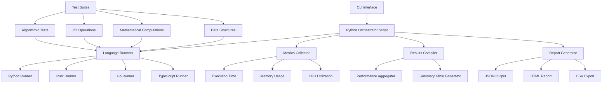
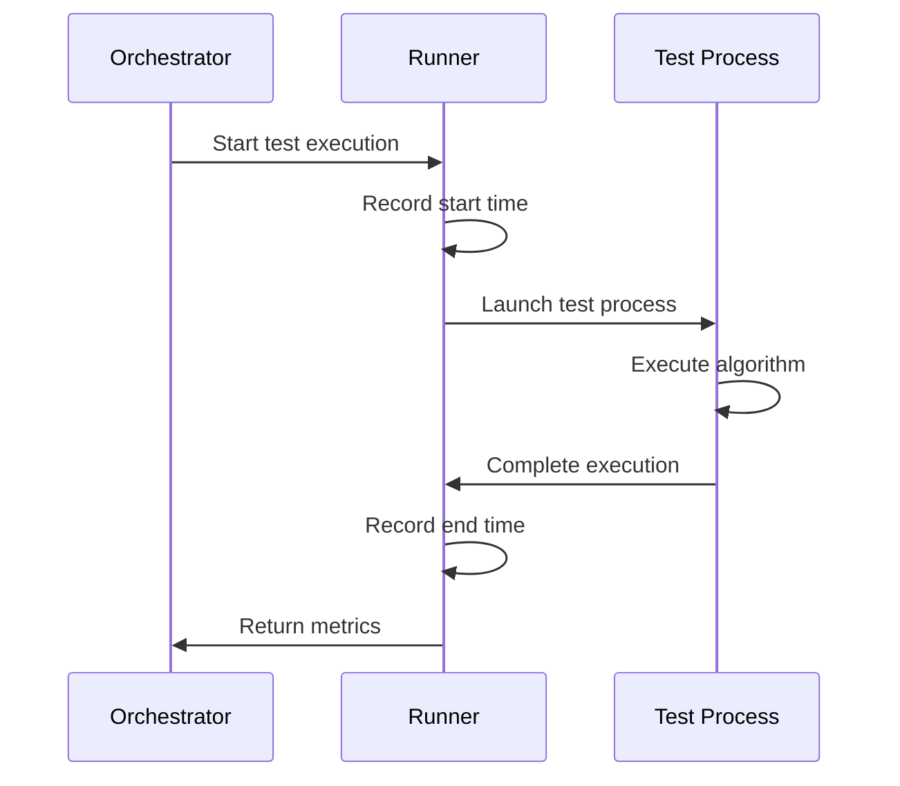

# Multi-Language Performance Benchmark Tool

## Overview

A comprehensive performance benchmarking tool designed to evaluate and compare execution performance across multiple programming languages: Python, Rust, Go, and TypeScript. The tool provides standardized test suites and metrics to facilitate fair performance comparisons between different language implementations.

### Core Objectives
- Execute identical algorithmic tasks across multiple languages
- Measure execution time, memory usage, and CPU utilization
- Generate comparative reports and visualizations
- Provide extensible framework for adding new languages and benchmarks

## Architecture



### Component Architecture

#### Python Orchestrator Script (`bench_orchestrator.py`)
Main Python script serving as the central coordinator:
- **Test Suite Management**: Discovers and schedules all benchmark tests
- **Language Runner Coordination**: Manages compilation and execution across languages
- **Results Compilation**: Aggregates performance data from all test runs
- **Performance Analysis**: Calculates statistics and generates comparison metrics
- **Report Generation**: Creates summary tables and detailed performance reports
- **Resource Monitoring**: Tracks system resources during benchmark execution

#### Orchestrator Core Functions
```python
class BenchmarkOrchestrator:
    def __init__(self, config_path: str)
    def discover_tests(self) -> List[TestSuite]
    def validate_environments(self) -> Dict[str, bool]
    def execute_benchmark_suite(self) -> BenchmarkResults
    def compile_results(self) -> PerformanceSummary
    def generate_summary_table(self) -> DataFrame
    def export_reports(self, formats: List[str])
```

#### Language Runners
Isolated execution environments for each language:
- **Python Runner**: Executes `.py` files using Python interpreter
- **Rust Runner**: Compiles and executes Rust binaries
- **Go Runner**: Compiles and executes Go binaries  
- **TypeScript Runner**: Transpiles and executes via Node.js

#### Metrics Collector
Performance monitoring system tracking:
- Execution time (nanosecond precision)
- Peak memory consumption
- CPU usage percentage
- System resource utilization

## Python Orchestrator Implementation

### Main Orchestrator Script Structure

#### Core Orchestrator Class
```python
class BenchmarkOrchestrator:
    def __init__(self, config_path: str = "bench.config.json"):
        self.config = self.load_configuration(config_path)
        self.languages = ["python", "rust", "go", "typescript"]
        self.test_suites = self.discover_test_suites()
        self.results = {}
        self.performance_summary = None
    
    def run_complete_benchmark(self) -> PerformanceSummary:
        """Execute full benchmark suite across all languages"""
        print("🚀 Starting Multi-Language Performance Benchmark")
        
        # Validation phase
        if not self.validate_all_environments():
            raise EnvironmentError("Some language environments are not ready")
        
        # Compilation phase for compiled languages
        self.compile_all_tests()
        
        # Execution phase
        for test_suite in self.test_suites:
            self.execute_test_suite(test_suite)
        
        # Results compilation and analysis
        self.performance_summary = self.compile_performance_results()
        
        # Generate summary tables and reports
        self.generate_all_reports()
        
        return self.performance_summary
```

#### Language Runner Management
```python
class LanguageRunner:
    def __init__(self, language: str, config: dict):
        self.language = language
        self.config = config
        self.executable = config.get("executable")
        self.compile_cmd = config.get("compile_cmd")
    
    def compile_test(self, test_path: str) -> bool:
        """Compile test for compiled languages (Rust, Go)"""
        if self.language in ["rust", "go"]:
            compile_command = f"{self.compile_cmd} {test_path}"
            return self.execute_command(compile_command)
        return True
    
    def execute_test(self, test_path: str, input_data: str) -> TestResult:
        """Execute test and collect performance metrics"""
        start_time = time.perf_counter()
        start_memory = psutil.Process().memory_info().rss
        
        # Execute test process
        result = self.run_test_process(test_path, input_data)
        
        end_time = time.perf_counter()
        end_memory = psutil.Process().memory_info().rss
        
        return TestResult(
            execution_time=end_time - start_time,
            memory_usage=max(end_memory - start_memory, 0),
            output=result.stdout,
            success=result.returncode == 0
        )
```

#### Results Compilation and Analysis
```python
class ResultsCompiler:
    def __init__(self, raw_results: Dict):
        self.raw_results = raw_results
        self.compiled_results = {}
        self.performance_metrics = {}
    
    def compile_all_results(self) -> PerformanceSummary:
        """Aggregate and analyze all benchmark results"""
        for test_name, language_results in self.raw_results.items():
            self.compiled_results[test_name] = self.analyze_test_results(language_results)
        
        self.calculate_performance_rankings()
        self.generate_statistical_summary()
        
        return PerformanceSummary(
            results=self.compiled_results,
            rankings=self.performance_rankings,
            statistics=self.statistical_summary
        )
    
    def analyze_test_results(self, language_results: Dict) -> TestAnalysis:
        """Analyze results for a specific test across languages"""
        analysis = {}
        
        for language, results in language_results.items():
            # Calculate statistics for multiple iterations
            times = [r.execution_time for r in results]
            memories = [r.memory_usage for r in results]
            
            analysis[language] = LanguagePerformance(
                avg_time=statistics.mean(times),
                min_time=min(times),
                max_time=max(times),
                std_time=statistics.stdev(times) if len(times) > 1 else 0,
                avg_memory=statistics.mean(memories),
                peak_memory=max(memories),
                success_rate=sum(1 for r in results if r.success) / len(results)
            )
        
        return TestAnalysis(language_performances=analysis)
```

### Performance Summary Table Generation

#### Summary Table Generator
```python
class SummaryTableGenerator:
    def __init__(self, performance_summary: PerformanceSummary):
        self.summary = performance_summary
        self.df_results = None
    
    def generate_comprehensive_table(self) -> pd.DataFrame:
        """Generate complete performance comparison table"""
        table_data = []
        
        for test_name, test_analysis in self.summary.results.items():
            for language, performance in test_analysis.language_performances.items():
                table_data.append({
                    'Test': test_name,
                    'Language': language,
                    'Avg Time (ms)': round(performance.avg_time * 1000, 2),
                    'Min Time (ms)': round(performance.min_time * 1000, 2),
                    'Max Time (ms)': round(performance.max_time * 1000, 2),
                    'Std Dev (ms)': round(performance.std_time * 1000, 2),
                    'Avg Memory (MB)': round(performance.avg_memory / 1024 / 1024, 2),
                    'Peak Memory (MB)': round(performance.peak_memory / 1024 / 1024, 2),
                    'Success Rate (%)': round(performance.success_rate * 100, 1),
                    'Performance Score': self.calculate_performance_score(performance)
                })
        
        self.df_results = pd.DataFrame(table_data)
        return self.df_results
    
    def generate_ranking_table(self) -> pd.DataFrame:
        """Generate language ranking table by test category"""
        ranking_data = []
        
        test_categories = self.group_tests_by_category()
        
        for category, tests in test_categories.items():
            category_scores = self.calculate_category_scores(tests)
            
            sorted_languages = sorted(category_scores.items(), 
                                    key=lambda x: x[1], reverse=True)
            
            for rank, (language, score) in enumerate(sorted_languages, 1):
                ranking_data.append({
                    'Category': category,
                    'Rank': rank,
                    'Language': language,
                    'Score': round(score, 2),
                    'Performance Level': self.get_performance_level(rank)
                })
        
        return pd.DataFrame(ranking_data)
    
    def generate_size_comparison_table(self) -> pd.DataFrame:
        """Generate binary/executable size comparison table"""
        size_data = []
        
        for test_name in self.summary.results.keys():
            for language in ['rust', 'go']:  # Compiled languages
                binary_path = self.get_binary_path(test_name, language)
                if os.path.exists(binary_path):
                    size_bytes = os.path.getsize(binary_path)
                    size_data.append({
                        'Test': test_name,
                        'Language': language,
                        'Binary Size (KB)': round(size_bytes / 1024, 2),
                        'Binary Size (MB)': round(size_bytes / 1024 / 1024, 3)
                    })
        
        return pd.DataFrame(size_data)
```

#### Performance Scoring System
```python
def calculate_performance_score(self, performance: LanguagePerformance) -> float:
    """Calculate normalized performance score (higher is better)"""
    # Normalize execution time (lower is better, so invert)
    time_score = 1000 / (performance.avg_time * 1000)  # Convert to ms
    
    # Normalize memory usage (lower is better, so invert)
    memory_score = 100 / (performance.avg_memory / 1024 / 1024)  # Convert to MB
    
    # Weight factors
    time_weight = 0.7
    memory_weight = 0.2
    reliability_weight = 0.1
    
    total_score = (
        time_score * time_weight +
        memory_score * memory_weight +
        performance.success_rate * 100 * reliability_weight
    )
    
    return total_score
```

### Report Export Functions

#### Multi-Format Report Exporter
```python
class ReportExporter:
    def __init__(self, summary_generator: SummaryTableGenerator):
        self.generator = summary_generator
        self.timestamp = datetime.now().strftime("%Y%m%d_%H%M%S")
    
    def export_all_formats(self, output_dir: str = "./results"):
        """Export reports in all supported formats"""
        os.makedirs(output_dir, exist_ok=True)
        
        # Generate all tables
        comprehensive_table = self.generator.generate_comprehensive_table()
        ranking_table = self.generator.generate_ranking_table()
        size_table = self.generator.generate_size_comparison_table()
        
        # Export CSV files
        self.export_csv_reports(output_dir, comprehensive_table, ranking_table, size_table)
        
        # Export HTML report
        self.export_html_report(output_dir, comprehensive_table, ranking_table, size_table)
        
        # Export JSON data
        self.export_json_report(output_dir)
        
        print(f"📊 Reports exported to {output_dir}/")
    
    def export_csv_reports(self, output_dir: str, *tables):
        """Export CSV format reports"""
        table_names = ['comprehensive', 'rankings', 'binary_sizes']
        
        for table, name in zip(tables, table_names):
            if table is not None and not table.empty:
                filename = f"{output_dir}/benchmark_{name}_{self.timestamp}.csv"
                table.to_csv(filename, index=False)
                print(f"✅ Exported {filename}")
    
    def export_html_report(self, output_dir: str, *tables):
        """Export interactive HTML report"""
        html_content = self.generate_html_template(*tables)
        filename = f"{output_dir}/benchmark_report_{self.timestamp}.html"
        
        with open(filename, 'w', encoding='utf-8') as f:
            f.write(html_content)
        
        print(f"🌐 Exported {filename}")
```

### Main Execution Script

#### Command Line Interface
```python
def main():
    parser = argparse.ArgumentParser(
        description='Multi-Language Performance Benchmark Tool'
    )
    parser.add_argument('--languages', '-l', 
                       choices=['python', 'rust', 'go', 'typescript'],
                       nargs='+', default=['python', 'rust', 'go', 'typescript'],
                       help='Languages to benchmark')
    parser.add_argument('--tests', '-t',
                       nargs='+', default=None,
                       help='Specific tests to run')
    parser.add_argument('--iterations', '-i',
                       type=int, default=10,
                       help='Number of iterations per test')
    parser.add_argument('--output', '-o',
                       choices=['json', 'html', 'csv', 'all'], default='all',
                       help='Output format')
    parser.add_argument('--config', '-c',
                       default='bench.config.json',
                       help='Configuration file path')
    
    args = parser.parse_args()
    
    # Initialize orchestrator
    orchestrator = BenchmarkOrchestrator(args.config)
    orchestrator.set_target_languages(args.languages)
    orchestrator.set_iterations(args.iterations)
    
    if args.tests:
        orchestrator.filter_tests(args.tests)
    
    try:
        # Run complete benchmark suite
        performance_summary = orchestrator.run_complete_benchmark()
        
        # Generate and export reports
        summary_generator = SummaryTableGenerator(performance_summary)
        exporter = ReportExporter(summary_generator)
        
        if args.output == 'all':
            exporter.export_all_formats()
        else:
            exporter.export_format(args.output)
        
        # Display summary in terminal
        print_terminal_summary(summary_generator)
        
    except Exception as e:
        print(f"❌ Benchmark execution failed: {e}")
        sys.exit(1)

if __name__ == "__main__":
    main()
```


### Primary Commands

#### `bench run`
Execute benchmark suite across all languages
```bash
bench run [options]
```

**Options:**
- `--languages, -l`: Specify languages to test (default: all)
- `--tests, -t`: Select specific test suites
- `--iterations, -i`: Number of iterations per test (default: 10)
- `--output, -o`: Output format (json|html|csv)
- `--timeout`: Maximum execution time per test (default: 30s)

**Example Usage:**
```bash
bench run -l python,rust,go -t algorithms,io --iterations 20
bench run --languages typescript --output html
```

#### `bench list`
Display available test suites and languages
```bash
bench list [--tests|--languages]
```

#### `bench compare`
Compare results between benchmark runs
```bash
bench compare <result1.json> <result2.json>
```

#### `bench validate`
Verify language environments and dependencies
```bash
bench validate [--languages]
```

### Command Details

#### Test Suite Execution Flow
1. **Environment Validation**: Verify language runtimes availability
2. **Test Compilation**: Compile tests for compiled languages (Rust, Go)
3. **Benchmark Execution**: Run tests with metrics collection
4. **Results Aggregation**: Collect and normalize performance data
5. **Report Generation**: Output results in specified format

#### Performance Metrics Collection
- **Execution Time**: Measured using high-resolution timers
- **Memory Usage**: Peak RSS (Resident Set Size) monitoring
- **CPU Utilization**: Process-specific CPU usage tracking
- **I/O Operations**: File system and network operation metrics

## Test Suites

### Algorithmic Tests
Performance evaluation of common algorithms:

| Test Name | Description | Complexity |
|-----------|-------------|------------|
| `fibonacci` | Recursive Fibonacci calculation | O(2^n) |
| `quicksort` | Array sorting algorithm | O(n log n) |
| `binary_search` | Binary search implementation | O(log n) |
| `matrix_multiply` | Matrix multiplication | O(n³) |
| `prime_sieve` | Sieve of Eratosthenes | O(n log log n) |

### Data Structure Operations
Testing common data structure performance:

| Test Name | Description | Operations |
|-----------|-------------|------------|
| `hash_table` | Hash map operations | Insert, lookup, delete |
| `binary_tree` | Binary tree traversal | Insert, search, traverse |
| `linked_list` | Linked list operations | Append, prepend, search |
| `dynamic_array` | Dynamic array operations | Push, pop, resize |

### I/O Operations
File system and network operation benchmarks:

| Test Name | Description | Metrics |
|-----------|-------------|---------|
| `file_read` | Large file reading | Throughput, latency |
| `file_write` | File writing operations | Write speed, sync time |
| `json_parse` | JSON parsing performance | Parse time, memory |
| `http_requests` | HTTP client performance | Request/response time |

### Mathematical Computations
Numerical computation performance:

| Test Name | Description | Focus |
|-----------|-------------|-------|
| `pi_calculation` | Monte Carlo π estimation | Floating-point operations |
| `fft` | Fast Fourier Transform | Complex number operations |
| `linear_algebra` | Vector/matrix operations | Mathematical libraries |

## Test Implementation Standards

### Code Structure Requirements
Each language implementation must follow standardized patterns:

```
tests/
├── algorithms/
│   ├── fibonacci/
│   │   ├── fibonacci.py
│   │   ├── fibonacci.rs
│   │   ├── fibonacci.go
│   │   └── fibonacci.ts
│   └── quicksort/
├── data_structures/
└── io_operations/
```

### Input/Output Specifications
- **Input**: Standardized test data files (JSON format)
- **Output**: Results written to stdout in JSON format
- **Error Handling**: Exit codes and stderr for error reporting

### Timing Methodology


## Configuration System

### Benchmark Configuration
Configuration file structure (`bench.config.json`):

```json
{
  "languages": {
    "python": {
      "executable": "python3",
      "version_check": "--version",
      "timeout": 60
    },
    "rust": {
      "compile_cmd": "rustc -O",
      "timeout": 30
    },
    "go": {
      "compile_cmd": "go build -ldflags='-s -w'",
      "timeout": 30
    },
    "typescript": {
      "executable": "node",
      "compile_cmd": "tsc",
      "timeout": 45
    }
  },
  "test_suites": {
    "algorithms": {
      "enabled": true,
      "timeout": 30,
      "iterations": 10
    }
  },
  "output": {
    "format": "json",
    "directory": "./results",
    "timestamp": true
  }
}
```

### Environment Variables
- `BENCH_CONFIG`: Path to configuration file
- `BENCH_RESULTS_DIR`: Output directory for results
- `BENCH_TIMEOUT`: Global timeout override
- `BENCH_VERBOSE`: Enable verbose logging

## Report Generation

### Output Formats

#### JSON Format
Structured data for programmatic analysis:
```json
{
  "benchmark_id": "bench_20241201_143052",
  "timestamp": "2024-12-01T14:30:52Z",
  "configuration": {
    "languages": ["python", "rust", "go", "typescript"],
    "iterations": 10,
    "timeout": 30
  },
  "results": {
    "fibonacci": {
      "python": {
        "avg_time_ms": 1245.67,
        "memory_peak_mb": 12.4,
        "cpu_usage_percent": 98.2
      }
    }
  }
}
```

#### HTML Report
Interactive web-based visualization:
- Performance comparison charts
- Language-specific breakdowns
- Test suite summaries
- Downloadable raw data

#### CSV Export
Tabular format for spreadsheet analysis:
```csv
test_name,language,avg_time_ms,memory_mb,cpu_percent,iterations
fibonacci,python,1245.67,12.4,98.2,10
fibonacci,rust,45.23,2.1,87.5,10
```

### Visualization Components
- **Performance Charts**: Bar charts comparing execution times
- **Memory Usage Graphs**: Line charts showing memory consumption
- **CPU Utilization**: Heatmaps of CPU usage patterns
- **Trend Analysis**: Performance trends across multiple runs

## Testing Strategy

### Unit Testing
Each component requires comprehensive unit tests:
- **Language Runners**: Mock process execution
- **Metrics Collector**: Validate measurement accuracy  
- **Report Generator**: Verify output format compliance
- **Configuration Parser**: Test configuration validation

### Integration Testing
End-to-end testing scenarios:
- Complete benchmark execution cycles
- Multi-language result comparison
- Report generation verification
- Error handling validation

### Performance Testing
Benchmark tool self-assessment:
- Overhead measurement (benchmark execution cost)
- Scalability testing with large test suites
- Resource utilization monitoring
- Concurrent execution validation

### Validation Testing
Accuracy verification methods:
- Known algorithm results validation
- Cross-language result consistency
- Performance metric accuracy assessment
- Statistical significance testing#### Performance Metrics Collection
- **Execution Time**: Measured using high-resolution timers
- **Memory Usage**: Peak RSS (Resident Set Size) monitoring
- **CPU Utilization**: Process-specific CPU usage tracking
- **I/O Operations**: File system and network operation metrics

## Test Suites

### Algorithmic Tests
Performance evaluation of common algorithms:

| Test Name | Description | Complexity |
|-----------|-------------|------------|
| `fibonacci` | Recursive Fibonacci calculation | O(2^n) |
| `quicksort` | Array sorting algorithm | O(n log n) |
| `binary_search` | Binary search implementation | O(log n) |
| `matrix_multiply` | Matrix multiplication | O(n³) |
| `prime_sieve` | Sieve of Eratosthenes | O(n log log n) |

### Data Structure Operations
Testing common data structure performance:

| Test Name | Description | Operations |
|-----------|-------------|------------|
| `hash_table` | Hash map operations | Insert, lookup, delete |
| `binary_tree` | Binary tree traversal | Insert, search, traverse |
| `linked_list` | Linked list operations | Append, prepend, search |
| `dynamic_array` | Dynamic array operations | Push, pop, resize |

### I/O Operations
File system and network operation benchmarks:

| Test Name | Description | Metrics |
|-----------|-------------|---------|
| `file_read` | Large file reading | Throughput, latency |
| `file_write` | File writing operations | Write speed, sync time |
| `json_parse` | JSON parsing performance | Parse time, memory |
| `http_requests` | HTTP client performance | Request/response time |

### Mathematical Computations
Numerical computation performance:

| Test Name | Description | Focus |
|-----------|-------------|-------|
| `pi_calculation` | Monte Carlo π estimation | Floating-point operations |
| `fft` | Fast Fourier Transform | Complex number operations |
| `linear_algebra` | Vector/matrix operations | Mathematical libraries |

## Test Implementation Standards

### Code Structure Requirements
Each language implementation must follow standardized patterns:

```
tests/
├── algorithms/
│   ├── fibonacci/
│   │   ├── fibonacci.py
│   │   ├── fibonacci.rs
│   │   ├── fibonacci.go
│   │   └── fibonacci.ts
│   └── quicksort/
├── data_structures/
└── io_operations/
```

### Input/Output Specifications
- **Input**: Standardized test data files (JSON format)
- **Output**: Results written to stdout in JSON format
- **Error Handling**: Exit codes and stderr for error reporting

### Timing Methodology


## Configuration System

### Benchmark Configuration
Configuration file structure (`bench.config.json`):

```json
{
  "languages": {
    "python": {
      "executable": "python3",
      "version_check": "--version",
      "timeout": 60
    },
    "rust": {
      "compile_cmd": "rustc -O",
      "timeout": 30
    },
    "go": {
      "compile_cmd": "go build -ldflags='-s -w'",
      "timeout": 30
    },
    "typescript": {
      "executable": "node",
      "compile_cmd": "tsc",
      "timeout": 45
    }
  },
  "test_suites": {
    "algorithms": {
      "enabled": true,
      "timeout": 30,
      "iterations": 10
    }
  },
  "output": {
    "format": "json",
    "directory": "./results",
    "timestamp": true
  }
}
```

### Environment Variables
- `BENCH_CONFIG`: Path to configuration file
- `BENCH_RESULTS_DIR`: Output directory for results
- `BENCH_TIMEOUT`: Global timeout override
- `BENCH_VERBOSE`: Enable verbose logging

## Report Generation

### Output Formats

#### JSON Format
Structured data for programmatic analysis:
```json
{
  "benchmark_id": "bench_20241201_143052",
  "timestamp": "2024-12-01T14:30:52Z",
  "configuration": {
    "languages": ["python", "rust", "go", "typescript"],
    "iterations": 10,
    "timeout": 30
  },
  "results": {
    "fibonacci": {
      "python": {
        "avg_time_ms": 1245.67,
        "memory_peak_mb": 12.4,
        "cpu_usage_percent": 98.2
      }
    }
  }
}
```

#### HTML Report
Interactive web-based visualization:
- Performance comparison charts
- Language-specific breakdowns
- Test suite summaries
- Downloadable raw data

#### CSV Export
Tabular format for spreadsheet analysis:
```csv
test_name,language,avg_time_ms,memory_mb,cpu_percent,iterations
fibonacci,python,1245.67,12.4,98.2,10
fibonacci,rust,45.23,2.1,87.5,10
```

### Visualization Components
- **Performance Charts**: Bar charts comparing execution times
- **Memory Usage Graphs**: Line charts showing memory consumption
- **CPU Utilization**: Heatmaps of CPU usage patterns
- **Trend Analysis**: Performance trends across multiple runs

## Testing Strategy

### Unit Testing
Each component requires comprehensive unit tests:
- **Language Runners**: Mock process execution
- **Metrics Collector**: Validate measurement accuracy  
- **Report Generator**: Verify output format compliance
- **Configuration Parser**: Test configuration validation

### Integration Testing
End-to-end testing scenarios:
- Complete benchmark execution cycles
- Multi-language result comparison
- Report generation verification
- Error handling validation

### Performance Testing
Benchmark tool self-assessment:
- Overhead measurement (benchmark execution cost)
- Scalability testing with large test suites
- Resource utilization monitoring
- Concurrent execution validation

### Validation Testing
Accuracy verification methods:
- Known algorithm results validation
- Cross-language result consistency
- Performance metric accuracy assessment
- Statistical significance testing

## Advanced Features

### Continuous Benchmarking
Integration with CI/CD pipelines for automated performance tracking:

#### GitHub Actions Integration
```yaml
name: Performance Benchmark
on:
  pull_request:
    branches: [main]
  schedule:
    - cron: '0 2 * * *'  # Daily at 2 AM

jobs:
  benchmark:
    runs-on: ubuntu-latest
    steps:
      - uses: actions/checkout@v3
      - name: Setup Languages
        run: |
          # Install Python, Rust, Go, Node.js
          sudo apt-get update
          curl --proto '=https' --tlsv1.2 -sSf https://sh.rustup.rs | sh -s -- -y
          wget https://golang.org/dl/go1.21.0.linux-amd64.tar.gz
          sudo tar -C /usr/local -xzf go1.21.0.linux-amd64.tar.gz
          
      - name: Run Benchmarks
        run: |
          python3 bench_orchestrator.py --output json
          
      - name: Upload Results
        uses: actions/upload-artifact@v3
        with:
          name: benchmark-results
          path: results/
```

### Performance Regression Detection
```python
class RegressionDetector:
    def __init__(self, historical_data_path: str):
        self.historical_data = self.load_historical_data(historical_data_path)
        self.threshold_percent = 15.0  # 15% performance degradation threshold
    
    def detect_regressions(self, current_results: PerformanceSummary) -> List[Regression]:
        regressions = []
        
        for test_name, current_analysis in current_results.results.items():
            if test_name in self.historical_data:
                historical_analysis = self.historical_data[test_name]
                
                for language in current_analysis.language_performances:
                    current_perf = current_analysis.language_performances[language]
                    historical_perf = historical_analysis.language_performances.get(language)
                    
                    if historical_perf:
                        performance_change = self.calculate_performance_change(
                            historical_perf, current_perf
                        )
                        
                        if performance_change.degradation_percent > self.threshold_percent:
                            regressions.append(Regression(
                                test_name=test_name,
                                language=language,
                                degradation_percent=performance_change.degradation_percent,
                                current_time=current_perf.avg_time,
                                historical_time=historical_perf.avg_time
                            ))
        
        return regressions
```

### Multi-Platform Support
Cross-platform execution capabilities:

#### Platform-Specific Configurations
```json
{
  "platforms": {
    "linux": {
      "rust": {
        "compile_cmd": "rustc -O --target x86_64-unknown-linux-gnu",
        "executable_ext": ""
      },
      "go": {
        "compile_cmd": "GOOS=linux GOARCH=amd64 go build"
      }
    },
    "windows": {
      "rust": {
        "compile_cmd": "rustc -O --target x86_64-pc-windows-msvc",
        "executable_ext": ".exe"
      },
      "go": {
        "compile_cmd": "GOOS=windows GOARCH=amd64 go build"
      }
    },
    "macos": {
      "rust": {
        "compile_cmd": "rustc -O --target x86_64-apple-darwin",
        "executable_ext": ""
      }
    }
  }
}
```

### Resource Monitoring Extensions

#### System Resource Monitor
```python
class SystemResourceMonitor:
    def __init__(self):
        self.process_monitor = psutil.Process()
        self.system_monitor = psutil
        self.monitoring_active = False
        self.metrics_history = []
    
    def start_monitoring(self, interval_seconds: float = 0.1):
        """Start continuous resource monitoring"""
        self.monitoring_active = True
        self.metrics_history = []
        
        def monitor_loop():
            while self.monitoring_active:
                metrics = {
                    'timestamp': time.time(),
                    'cpu_percent': self.process_monitor.cpu_percent(),
                    'memory_rss': self.process_monitor.memory_info().rss,
                    'memory_vms': self.process_monitor.memory_info().vms,
                    'io_read_bytes': self.process_monitor.io_counters().read_bytes,
                    'io_write_bytes': self.process_monitor.io_counters().write_bytes,
                    'system_cpu': self.system_monitor.cpu_percent(),
                    'system_memory': self.system_monitor.virtual_memory().percent
                }
                self.metrics_history.append(metrics)
                time.sleep(interval_seconds)
        
        self.monitor_thread = threading.Thread(target=monitor_loop)
        self.monitor_thread.start()
    
    def stop_monitoring(self) -> ResourceMetrics:
        """Stop monitoring and return aggregated metrics"""
        self.monitoring_active = False
        self.monitor_thread.join()
        
        if not self.metrics_history:
            return ResourceMetrics()
        
        # Aggregate metrics
        peak_memory = max(m['memory_rss'] for m in self.metrics_history)
        avg_cpu = statistics.mean(m['cpu_percent'] for m in self.metrics_history)
        total_io_read = self.metrics_history[-1]['io_read_bytes'] - self.metrics_history[0]['io_read_bytes']
        total_io_write = self.metrics_history[-1]['io_write_bytes'] - self.metrics_history[0]['io_write_bytes']
        
        return ResourceMetrics(
            peak_memory_bytes=peak_memory,
            average_cpu_percent=avg_cpu,
            total_io_read_bytes=total_io_read,
            total_io_write_bytes=total_io_write,
            duration_seconds=self.metrics_history[-1]['timestamp'] - self.metrics_history[0]['timestamp']
        )
```

### Extensibility Framework

#### Plugin System for Custom Tests
```python
class BenchmarkPlugin:
    """Base class for custom benchmark plugins"""
    
    def __init__(self, name: str, category: str):
        self.name = name
        self.category = category
    
    def get_test_configurations(self) -> List[TestConfiguration]:
        """Return list of test configurations this plugin provides"""
        raise NotImplementedError
    
    def validate_environment(self, language: str) -> bool:
        """Validate if environment supports this plugin for given language"""
        return True
    
    def generate_test_data(self, config: TestConfiguration) -> dict:
        """Generate test input data for the configuration"""
        raise NotImplementedError
    
    def validate_result(self, result: dict, expected: dict) -> bool:
        """Validate test result correctness"""
        return True

class CustomAlgorithmPlugin(BenchmarkPlugin):
    """Example plugin for custom algorithm benchmarks"""
    
    def __init__(self):
        super().__init__("custom_algorithms", "algorithms")
    
    def get_test_configurations(self) -> List[TestConfiguration]:
        return [
            TestConfiguration(
                name="dijkstra_shortest_path",
                category="algorithms",
                complexity="O(V²)",
                parameters={
                    'graph_size': [100, 500, 1000],
                    'edge_density': [0.3, 0.5, 0.8]
                }
            ),
            TestConfiguration(
                name="knapsack_dynamic",
                category="algorithms", 
                complexity="O(nW)",
                parameters={
                    'items_count': [50, 100, 200],
                    'capacity': [1000, 5000, 10000]
                }
            )
        ]
```

### Deployment and Distribution

#### Docker Container Support
```dockerfile
FROM ubuntu:22.04

# Install system dependencies
RUN apt-get update && apt-get install -y \
    python3 \
    python3-pip \
    curl \
    wget \
    build-essential

# Install Rust
RUN curl --proto '=https' --tlsv1.2 -sSf https://sh.rustup.rs | sh -s -- -y
ENV PATH="/root/.cargo/bin:${PATH}"

# Install Go
RUN wget https://golang.org/dl/go1.21.0.linux-amd64.tar.gz && \
    tar -C /usr/local -xzf go1.21.0.linux-amd64.tar.gz
ENV PATH="/usr/local/go/bin:${PATH}"

# Install Node.js and TypeScript
RUN curl -fsSL https://deb.nodesource.com/setup_18.x | bash - && \
    apt-get install -y nodejs && \
    npm install -g typescript

# Install Python dependencies
COPY requirements.txt .
RUN pip3 install -r requirements.txt

# Copy benchmark tool
COPY . /app
WORKDIR /app

# Set entry point
ENTRYPOINT ["python3", "bench_orchestrator.py"]
```

#### Package Distribution
```python
# setup.py
from setuptools import setup, find_packages

setup(
    name="multi-lang-benchmark",
    version="1.0.0",
    description="Multi-language performance benchmarking tool",
    author="Benchmark Team",
    packages=find_packages(),
    install_requires=[
        "psutil>=5.9.0",
        "pandas>=1.5.0",
        "numpy>=1.24.0",
        "matplotlib>=3.6.0",
        "jinja2>=3.1.0",
        "click>=8.1.0"
    ],
    entry_points={
        'console_scripts': [
            'bench=benchmark.cli:main',
        ],
    },
    python_requires='>=3.8',
    classifiers=[
        "Development Status :: 4 - Beta",
        "Intended Audience :: Developers",
        "Programming Language :: Python :: 3.8+",
        "Topic :: Software Development :: Testing",
    ]
)
```

## Compilation and Optimization Strategies

### Language-Specific Optimization Profiles

#### Rust Optimization Levels
```toml
# Cargo.toml profiles for different optimization levels
[profile.benchmark-fast]
inherits = "release"
opt-level = 3
lto = "fat"
codegen-units = 1
panic = "abort"

[profile.benchmark-size]
inherits = "release"
opt-level = "s"
lto = "fat"
codegen-units = 1
strip = true

[profile.benchmark-debug]
inherits = "dev"
opt-level = 1
debug = true
```

#### Go Build Optimization
```bash
# Performance-optimized builds
go build -ldflags="-s -w -X main.version=benchmark" \
         -gcflags="-B -C" \
         -asmflags="-B" \
         -trimpath

# Size-optimized builds  
go build -ldflags="-s -w" \
         -gcflags="-dwarf=false" \
         -trimpath

# Debug builds with profiling
go build -gcflags="-N -l" \
         -race
```

#### TypeScript/Node.js Optimization
```json
{
  "compilerOptions": {
    "target": "ES2022",
    "module": "CommonJS",
    "moduleResolution": "node",
    "strict": true,
    "esModuleInterop": true,
    "skipLibCheck": true,
    "forceConsistentCasingInFileNames": true,
    "optimizeConstEnums": true,
    "removeComments": true,
    "sourceMap": false
  },
  "ts-node": {
    "compilerOptions": {
      "target": "ES2022",
      "module": "CommonJS"
    }
  }
}
```

### Compilation Strategy Manager
```python
class CompilationManager:
    def __init__(self):
        self.optimization_profiles = {
            'performance': {
                'rust': ['--release', '-C', 'target-cpu=native', '-C', 'opt-level=3'],
                'go': ['-ldflags=-s -w', '-gcflags=-B'],
                'typescript': ['--target', 'ES2022', '--module', 'CommonJS']
            },
            'size': {
                'rust': ['--release', '-C', 'opt-level=s', '-C', 'lto=fat'],
                'go': ['-ldflags=-s -w', '-trimpath'],
                'typescript': ['--removeComments', '--optimizeConstEnums']
            },
            'debug': {
                'rust': ['-C', 'opt-level=1', '-g'],
                'go': ['-gcflags=-N -l', '-race'],
                'typescript': ['--sourceMap', '--incremental']
            }
        }
    
    def compile_with_profile(self, language: str, source_path: str, 
                           profile: str = 'performance') -> CompilationResult:
        """Compile source code with specified optimization profile"""
        flags = self.optimization_profiles[profile].get(language, [])
        
        if language == 'rust':
            return self.compile_rust(source_path, flags)
        elif language == 'go':
            return self.compile_go(source_path, flags)
        elif language == 'typescript':
            return self.compile_typescript(source_path, flags)
        
        return CompilationResult(success=False, error="Unsupported language")
    
    def measure_compilation_metrics(self, language: str, source_path: str) -> CompilationMetrics:
        """Measure compilation time and binary size for different profiles"""
        metrics = {}
        
        for profile_name in self.optimization_profiles.keys():
            start_time = time.perf_counter()
            result = self.compile_with_profile(language, source_path, profile_name)
            compile_time = time.perf_counter() - start_time
            
            if result.success:
                binary_size = os.path.getsize(result.binary_path)
                metrics[profile_name] = {
                    'compile_time_seconds': compile_time,
                    'binary_size_bytes': binary_size,
                    'binary_path': result.binary_path
                }
        
        return CompilationMetrics(profile_metrics=metrics)
```

## Memory Profiling and Analysis

### Advanced Memory Monitoring
```python
class MemoryProfiler:
    def __init__(self, sampling_interval: float = 0.01):
        self.sampling_interval = sampling_interval
        self.memory_samples = []
        self.profiling_active = False
    
    def start_profiling(self, target_process: psutil.Process):
        """Start memory profiling for target process"""
        self.profiling_active = True
        self.memory_samples = []
        
        def profile_memory():
            while self.profiling_active:
                try:
                    memory_info = target_process.memory_info()
                    memory_percent = target_process.memory_percent()
                    
                    sample = MemorySample(
                        timestamp=time.perf_counter(),
                        rss_bytes=memory_info.rss,
                        vms_bytes=memory_info.vms,
                        percent=memory_percent,
                        available_system_memory=psutil.virtual_memory().available
                    )
                    
                    self.memory_samples.append(sample)
                    
                except (psutil.NoSuchProcess, psutil.AccessDenied):
                    break
                    
                time.sleep(self.sampling_interval)
        
        self.profiling_thread = threading.Thread(target=profile_memory)
        self.profiling_thread.start()
    
    def stop_profiling(self) -> MemoryProfile:
        """Stop profiling and return analysis"""
        self.profiling_active = False
        if hasattr(self, 'profiling_thread'):
            self.profiling_thread.join()
        
        return self.analyze_memory_usage()
    
    def analyze_memory_usage(self) -> MemoryProfile:
        """Analyze collected memory samples"""
        if not self.memory_samples:
            return MemoryProfile()
        
        rss_values = [sample.rss_bytes for sample in self.memory_samples]
        vms_values = [sample.vms_bytes for sample in self.memory_samples]
        
        # Calculate memory statistics
        peak_rss = max(rss_values)
        avg_rss = statistics.mean(rss_values)
        min_rss = min(rss_values)
        
        # Detect memory leaks (increasing trend)
        memory_growth_rate = self.calculate_growth_rate(rss_values)
        
        # Calculate memory allocation patterns
        allocation_spikes = self.detect_allocation_spikes(rss_values)
        
        return MemoryProfile(
            peak_memory_bytes=peak_rss,
            average_memory_bytes=avg_rss,
            minimum_memory_bytes=min_rss,
            memory_growth_rate=memory_growth_rate,
            allocation_spikes=allocation_spikes,
            total_samples=len(self.memory_samples),
            profiling_duration=self.memory_samples[-1].timestamp - self.memory_samples[0].timestamp
        )
    
    def calculate_growth_rate(self, memory_values: List[int]) -> float:
        """Calculate memory growth rate per second"""
        if len(memory_values) < 2:
            return 0.0
        
        # Linear regression to find growth trend
        x = list(range(len(memory_values)))
        y = memory_values
        
        n = len(x)
        sum_x = sum(x)
        sum_y = sum(y)
        sum_xy = sum(x[i] * y[i] for i in range(n))
        sum_x2 = sum(x[i] ** 2 for i in range(n))
        
        slope = (n * sum_xy - sum_x * sum_y) / (n * sum_x2 - sum_x ** 2)
        
        # Convert to bytes per second
        samples_per_second = 1.0 / self.sampling_interval
        return slope * samples_per_second
    
    def detect_allocation_spikes(self, memory_values: List[int]) -> List[AllocationSpike]:
        """Detect sudden memory allocation spikes"""
        spikes = []
        threshold_factor = 1.5  # 50% increase threshold
        
        for i in range(1, len(memory_values)):
            prev_value = memory_values[i-1]
            current_value = memory_values[i]
            
            if current_value > prev_value * threshold_factor:
                spike = AllocationSpike(
                    timestamp=self.memory_samples[i].timestamp,
                    previous_memory=prev_value,
                    spike_memory=current_value,
                    increase_factor=current_value / prev_value
                )
                spikes.append(spike)
        
        return spikes
```

### Garbage Collection Analysis
```python
class GarbageCollectionAnalyzer:
    def __init__(self):
        self.gc_events = []
        self.monitoring_active = False
    
    def monitor_python_gc(self):
        """Monitor Python garbage collection events"""
        import gc
        
        # Set up GC callbacks
        def gc_callback(phase, info):
            if self.monitoring_active:
                self.gc_events.append({
                    'timestamp': time.perf_counter(),
                    'phase': phase,
                    'generation': info.get('generation', -1),
                    'collected': info.get('collected', 0),
                    'connections': info.get('connections', 0)
                })
        
        gc.callbacks.append(gc_callback)
        self.monitoring_active = True
    
    def analyze_gc_impact(self) -> GCAnalysis:
        """Analyze garbage collection impact on performance"""
        if not self.gc_events:
            return GCAnalysis(total_collections=0)
        
        total_collections = len(self.gc_events)
        total_objects_collected = sum(event['collected'] for event in self.gc_events)
        
        # Calculate GC frequency
        duration = self.gc_events[-1]['timestamp'] - self.gc_events[0]['timestamp']
        gc_frequency = total_collections / duration if duration > 0 else 0
        
        # Analyze by generation (Python-specific)
        generation_stats = {}
        for event in self.gc_events:
            gen = event['generation']
            if gen not in generation_stats:
                generation_stats[gen] = {'count': 0, 'collected': 0}
            generation_stats[gen]['count'] += 1
            generation_stats[gen]['collected'] += event['collected']
        
        return GCAnalysis(
            total_collections=total_collections,
            total_objects_collected=total_objects_collected,
            gc_frequency_per_second=gc_frequency,
            generation_statistics=generation_stats
        )
```

## Statistical Analysis and Reporting

### Advanced Statistical Methods
```python
class StatisticalAnalyzer:
    def __init__(self):
        self.confidence_level = 0.95
        self.min_sample_size = 10
    
    def calculate_statistical_significance(self, results1: List[float], 
                                         results2: List[float]) -> StatisticalTest:
        """Perform statistical significance test between two result sets"""
        from scipy import stats
        
        # Perform Welch's t-test (unequal variances)
        t_statistic, p_value = stats.ttest_ind(results1, results2, equal_var=False)
        
        # Calculate effect size (Cohen's d)
        pooled_std = np.sqrt(((len(results1) - 1) * np.var(results1, ddof=1) + 
                             (len(results2) - 1) * np.var(results2, ddof=1)) / 
                            (len(results1) + len(results2) - 2))
        
        cohens_d = (np.mean(results1) - np.mean(results2)) / pooled_std
        
        # Determine significance
        alpha = 1 - self.confidence_level
        is_significant = p_value < alpha
        
        return StatisticalTest(
            t_statistic=t_statistic,
            p_value=p_value,
            cohens_d=cohens_d,
            is_significant=is_significant,
            confidence_level=self.confidence_level,
            sample_size_1=len(results1),
            sample_size_2=len(results2)
        )
    
    def calculate_confidence_intervals(self, data: List[float]) -> ConfidenceInterval:
        """Calculate confidence intervals for performance metrics"""
        from scipy import stats
        
        n = len(data)
        mean = np.mean(data)
        std_err = stats.sem(data)
        
        # Calculate confidence interval
        h = std_err * stats.t.ppf((1 + self.confidence_level) / 2., n-1)
        
        return ConfidenceInterval(
            mean=mean,
            lower_bound=mean - h,
            upper_bound=mean + h,
            confidence_level=self.confidence_level,
            margin_of_error=h
        )
    
    def detect_outliers(self, data: List[float]) -> OutlierAnalysis:
        """Detect statistical outliers in performance data"""
        q1 = np.percentile(data, 25)
        q3 = np.percentile(data, 75)
        iqr = q3 - q1
        
        lower_bound = q1 - 1.5 * iqr
        upper_bound = q3 + 1.5 * iqr
        
        outliers = [x for x in data if x < lower_bound or x > upper_bound]
        outlier_indices = [i for i, x in enumerate(data) if x < lower_bound or x > upper_bound]
        
        return OutlierAnalysis(
            outliers=outliers,
            outlier_indices=outlier_indices,
            outlier_count=len(outliers),
            outlier_percentage=(len(outliers) / len(data)) * 100,
            lower_bound=lower_bound,
            upper_bound=upper_bound
        )
```

### Performance Trend Analysis
```python
class TrendAnalyzer:
    def __init__(self, historical_data_path: str):
        self.historical_data = self.load_historical_data(historical_data_path)
    
    def analyze_performance_trends(self, test_name: str, language: str, 
                                 timeframe_days: int = 30) -> TrendAnalysis:
        """Analyze performance trends over specified timeframe"""
        cutoff_date = datetime.now() - timedelta(days=timeframe_days)
        
        # Filter historical data
        relevant_data = [
            entry for entry in self.historical_data[test_name][language]
            if datetime.fromisoformat(entry['timestamp']) >= cutoff_date
        ]
        
        if len(relevant_data) < 2:
            return TrendAnalysis(insufficient_data=True)
        
        # Extract time series data
        timestamps = [datetime.fromisoformat(entry['timestamp']) for entry in relevant_data]
        execution_times = [entry['avg_time_ms'] for entry in relevant_data]
        memory_usage = [entry['memory_mb'] for entry in relevant_data]
        
        # Calculate trends
        time_trend = self.calculate_linear_trend(timestamps, execution_times)
        memory_trend = self.calculate_linear_trend(timestamps, memory_usage)
        
        # Detect performance improvements/degradations
        recent_avg = np.mean(execution_times[-5:])  # Last 5 measurements
        historical_avg = np.mean(execution_times[:-5])  # All but last 5
        
        performance_change = ((recent_avg - historical_avg) / historical_avg) * 100
        
        return TrendAnalysis(
            timeframe_days=timeframe_days,
            data_points=len(relevant_data),
            execution_time_trend=time_trend,
            memory_usage_trend=memory_trend,
            performance_change_percent=performance_change,
            trend_direction=self.classify_trend(time_trend.slope),
            statistical_significance=self.test_trend_significance(timestamps, execution_times)
        )
    
    def calculate_linear_trend(self, x_data: List[datetime], y_data: List[float]) -> TrendLine:
        """Calculate linear trend line for time series data"""
        # Convert datetime to numeric values
        x_numeric = [(dt - x_data[0]).total_seconds() for dt in x_data]
        
        # Calculate linear regression
        slope, intercept, r_value, p_value, std_err = stats.linregress(x_numeric, y_data)
        
        return TrendLine(
            slope=slope,
            intercept=intercept,
            r_squared=r_value**2,
            p_value=p_value,
            standard_error=std_err
        )
```

## Usage Examples and Implementation

### Basic Usage Examples

#### Running Complete Benchmark Suite
```bash
# Run all tests across all languages
python3 bench_orchestrator.py

# Run specific languages only
python3 bench_orchestrator.py --languages python,rust,go

# Run specific test categories
python3 bench_orchestrator.py --tests algorithms,data_structures

# Custom iterations and output format
python3 bench_orchestrator.py --iterations 20 --output html

# Run with specific size categories
python3 bench_orchestrator.py --size-category large --timeout 60
```

#### Advanced Usage Scenarios
```bash
# Performance regression testing
python3 bench_orchestrator.py \
  --baseline-file results/baseline_20241201.json \
  --regression-threshold 10 \
  --output json

# Memory profiling enabled
python3 bench_orchestrator.py \
  --enable-memory-profiling \
  --memory-sampling-interval 0.01 \
  --languages rust,go

# Custom plugin testing
python3 bench_orchestrator.py \
  --plugin-dir custom_plugins/ \
  --tests custom_algorithms \
  --verbose

# Multi-platform comparison
python3 bench_orchestrator.py \
  --platform-config platforms.json \
  --cross-compile \
  --output csv,html
```

### Configuration Examples

#### Custom Benchmark Configuration (`custom_bench.config.json`)
```json
{
  "languages": {
    "python": {
      "executable": "python3.11",
      "optimization_flags": ["-O"],
      "timeout": 120,
      "memory_limit_mb": 1024
    },
    "rust": {
      "compile_cmd": "rustc",
      "compile_flags": ["-C", "opt-level=3", "-C", "target-cpu=native"],
      "timeout": 60,
      "memory_limit_mb": 512
    },
    "go": {
      "compile_cmd": "go build",
      "compile_flags": ["-ldflags=-s -w", "-gcflags=-B"],
      "timeout": 45,
      "memory_limit_mb": 512
    },
    "typescript": {
      "executable": "node",
      "compile_cmd": "tsc",
      "compile_flags": ["--target", "ES2022", "--optimize"],
      "timeout": 90,
      "memory_limit_mb": 768
    }
  },
  "test_suites": {
    "algorithms": {
      "enabled": true,
      "timeout": 30,
      "iterations": 15,
      "size_categories": ["small", "medium", "large"]
    },
    "data_structures": {
      "enabled": true,
      "timeout": 20,
      "iterations": 10,
      "memory_profiling": true
    },
    "io_operations": {
      "enabled": true,
      "timeout": 45,
      "iterations": 5,
      "network_tests": false
    },
    "mathematical": {
      "enabled": false,
      "timeout": 60,
      "iterations": 8,
      "precision_validation": true
    }
  },
  "output": {
    "format": ["json", "html", "csv"],
    "directory": "./custom_results",
    "timestamp": true,
    "compression": true,
    "retention_days": 30
  },
  "analysis": {
    "statistical_significance": true,
    "confidence_level": 0.95,
    "outlier_detection": true,
    "regression_threshold_percent": 15,
    "memory_leak_detection": true
  }
}
```

### Integration Examples

#### Python API Integration
```python
from benchmark_orchestrator import BenchmarkOrchestrator, TestConfiguration
from benchmark_analyzer import StatisticalAnalyzer, TrendAnalyzer

# Initialize orchestrator
orchestrator = BenchmarkOrchestrator("custom_bench.config.json")

# Set custom test configuration
test_config = TestConfiguration(
    languages=["python", "rust", "go"],
    test_categories=["algorithms", "data_structures"],
    iterations=15,
    size_category="medium",
    enable_memory_profiling=True
)

# Run benchmarks
results = orchestrator.run_benchmark_suite(test_config)

# Analyze results
analyzer = StatisticalAnalyzer()
statistical_summary = analyzer.analyze_results(results)

# Generate reports
report_generator = ReportGenerator()
report_generator.generate_html_report(
    results, 
    statistical_summary, 
    output_path="./reports/custom_benchmark.html"
)

# Check for regressions
if baseline_results:
    regressions = analyzer.detect_regressions(
        current_results=results,
        baseline_results=baseline_results,
        threshold_percent=10
    )
    
    if regressions:
        print(f"⚠️ {len(regressions)} performance regressions detected!")
        for regression in regressions:
            print(f"  - {regression.test_name} ({regression.language}): +{regression.degradation_percent:.1f}%")
```

#### Custom Test Plugin Example
```python
class NetworkBenchmarkPlugin(BenchmarkPlugin):
    """Custom plugin for network performance tests"""
    
    def __init__(self):
        super().__init__("network_operations", "io_operations")
    
    def get_test_configurations(self) -> List[TestConfiguration]:
        return [
            TestConfiguration(
                name="http_client_performance",
                category="io_operations",
                complexity="O(n)",
                parameters={
                    'request_count': [100, 500, 1000],
                    'concurrent_connections': [1, 10, 50],
                    'payload_size_kb': [1, 10, 100]
                }
            ),
            TestConfiguration(
                name="websocket_throughput",
                category="io_operations",
                complexity="O(n)",
                parameters={
                    'message_count': [1000, 5000, 10000],
                    'message_size_bytes': [64, 512, 4096]
                }
            )
        ]
    
    def generate_test_data(self, config: TestConfiguration) -> dict:
        if config.name == "http_client_performance":
            return {
                'test_name': 'http_client_performance',
                'category': 'io_operations',
                'input': {
                    'server_url': 'http://httpbin.org',
                    'parameters': config.parameters
                },
                'expected_validation': {
                    'success_rate_min': 0.95,
                    'avg_latency_max_ms': 1000
                }
            }
        
        return super().generate_test_data(config)
```

### Performance Optimization Guidelines

#### Language-Specific Best Practices

**Python Optimization:**
- Use `numpy` for numerical computations
- Implement critical paths in Cython if needed
- Leverage `multiprocessing` for CPU-bound tasks
- Use `asyncio` for I/O-bound operations

**Rust Optimization:**
- Enable link-time optimization (`lto = true`)
- Use `#[inline]` for small, frequently called functions
- Leverage zero-cost abstractions (iterators, closures)
- Profile with `cargo flamegraph` for bottleneck identification

**Go Optimization:**
- Use build constraints for optimized builds
- Leverage goroutines for concurrent operations
- Profile with `go tool pprof` for memory/CPU analysis
- Use sync.Pool for object reuse

**TypeScript/Node.js Optimization:**
- Enable V8 optimization flags (`--turbo-fan`)
- Use typed arrays for numerical operations
- Leverage Worker Threads for CPU-intensive tasks
- Profile with Chrome DevTools or clinic.js

### Result Interpretation Guide

#### Understanding Performance Metrics

**Execution Time Analysis:**
- **Mean Time**: Primary performance indicator
- **Standard Deviation**: Consistency measure (lower is better)
- **Min/Max Time**: Performance range analysis
- **Percentiles**: Distribution understanding (P95, P99)

**Memory Usage Analysis:**
- **Peak Memory**: Maximum memory consumption
- **Average Memory**: Steady-state memory usage
- **Memory Growth Rate**: Leak detection indicator
- **Allocation Patterns**: GC impact assessment

**Statistical Significance:**
- **p-value < 0.05**: Statistically significant difference
- **Cohen's d**: Effect size (0.2=small, 0.5=medium, 0.8=large)
- **Confidence Intervals**: Result reliability range
- **Sample Size**: Minimum 10 iterations recommended

#### Performance Ranking Interpretation
```python
def interpret_performance_score(score: float) -> str:
    """Interpret performance score ranges"""
    if score >= 90:
        return "🚀 Excellent Performance"
    elif score >= 70:
        return "✅ Good Performance"
    elif score >= 50:
        return "⚠️ Average Performance"
    elif score >= 30:
        return "🐌 Below Average Performance"
    else:
        return "❌ Poor Performance"
```


