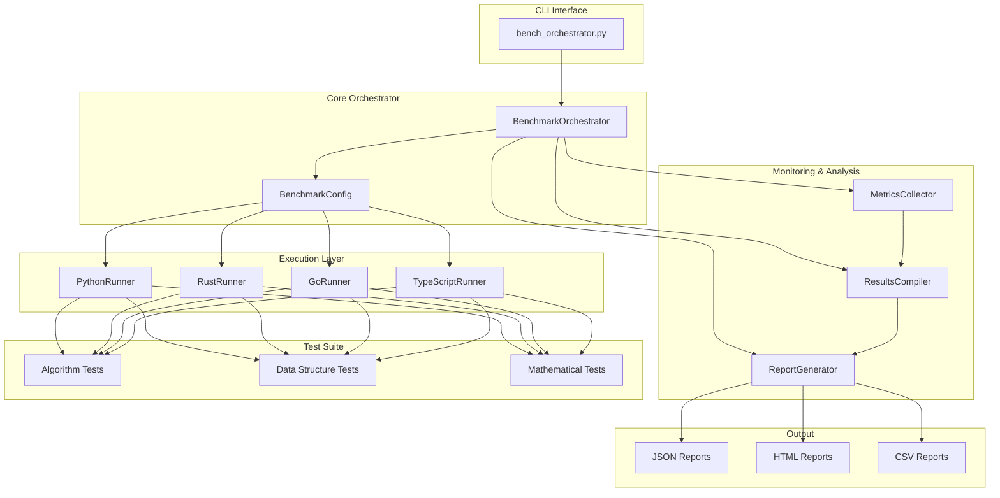
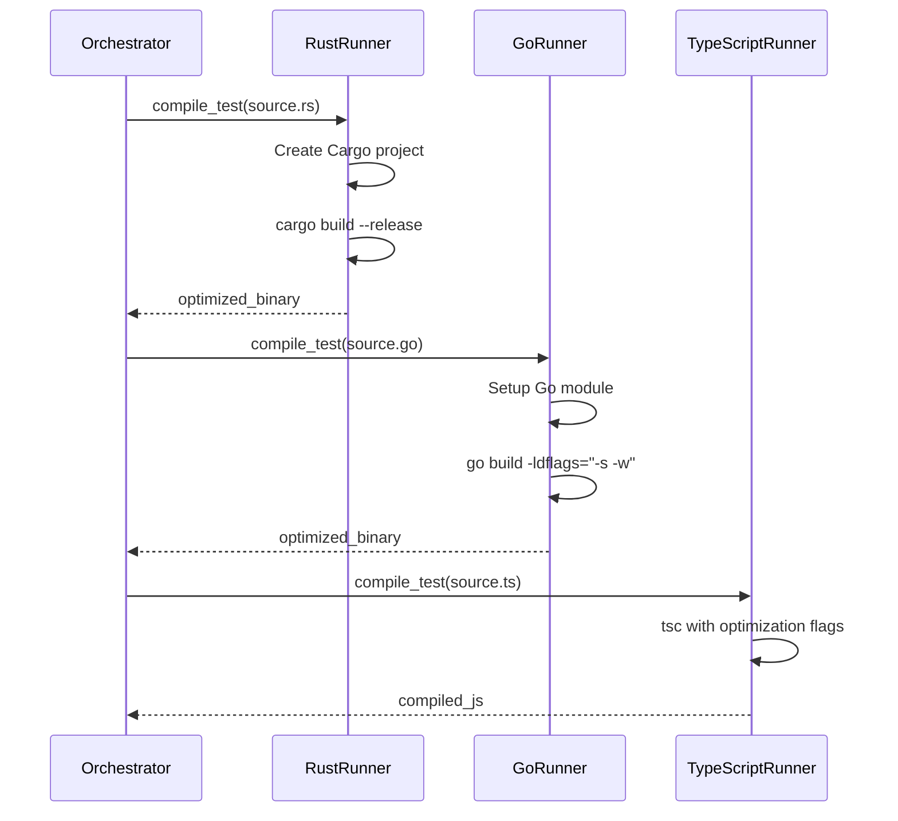
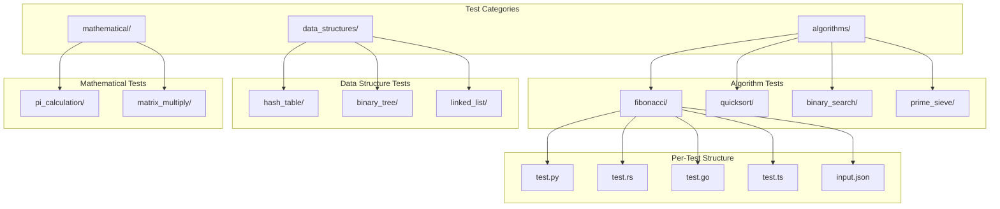
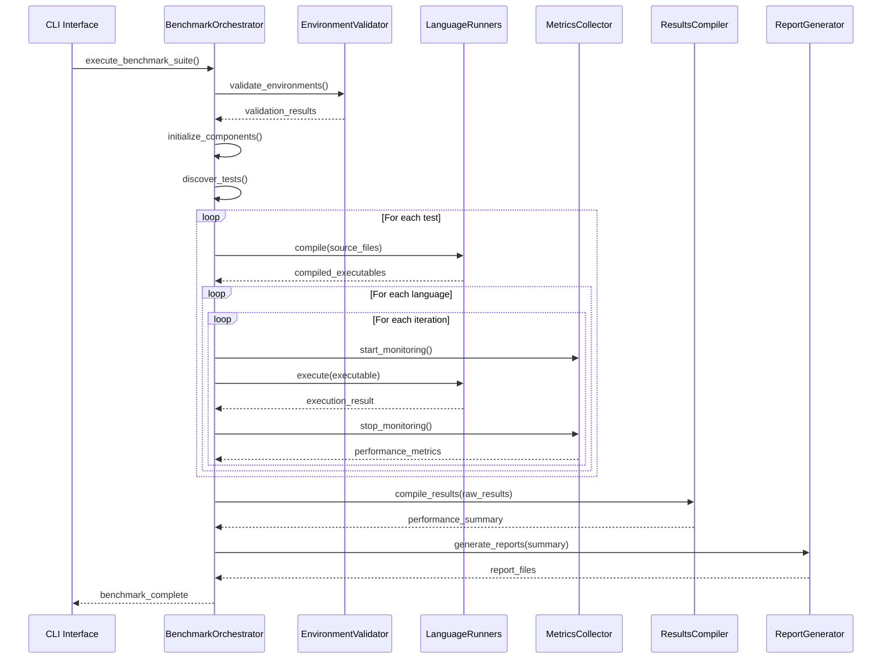
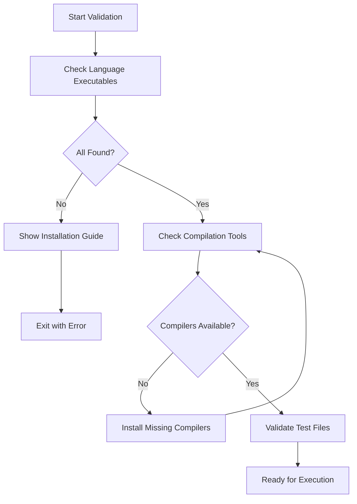

# Multi-Language Performance Benchmark System Design

## Overview

The Multi-Language Performance Benchmark System is a comprehensive tool for evaluating and comparing the runtime performance of different programming languages across standardized computational tasks. The system orchestrates benchmark execution across Python, Rust, Go, and TypeScript, providing detailed performance metrics and comparative analysis.

### Core Objectives
- Standardized cross-language performance comparison
- Reproducible benchmark results across environments  
- Comprehensive performance metrics collection (execution time, memory usage, CPU utilization)
- Multi-format reporting with statistical analysis
- Extensible architecture for adding new languages and tests

### Target Use Cases
- Performance engineering teams comparing language choices
- Developers evaluating language efficiency for specific algorithms
- Research groups studying language performance characteristics
- Educational institutions teaching performance analysis concepts

## Technology Stack & Dependencies

### Core Runtime
- **Python 3.8+**: Primary orchestration platform
- **Language Runtimes**: 
  - Python (interpreter-based execution)
  - Rust (compiled via Cargo)
  - Go (compiled via Go toolchain)
  - TypeScript (transpiled via tsc, executed via Node.js)

### Key Dependencies
```
psutil>=5.9.0          # System metrics collection
pandas>=1.5.0          # Data analysis and aggregation
numpy>=1.24.0          # Statistical computations
jinja2>=3.1.0          # HTML report templating
matplotlib>=3.6.0      # Static chart generation
plotly>=5.15.0         # Interactive visualizations
colorama>=0.4.6        # Terminal color output
tqdm>=4.64.0           # Progress indicators
tabulate>=0.9.0        # Formatted table output
```

### Development Tools
```
pytest>=7.2.0         # Unit testing framework
pytest-cov>=4.0.0     # Code coverage analysis
black>=22.0.0          # Code formatting
flake8>=5.0.0          # Linting and style checking
```

## Architecture

### System Architecture



### Component Architecture

#### 1. BenchmarkOrchestrator (Core)
Central coordination component managing the entire benchmark lifecycle:

**Responsibilities:**
- Configuration loading and validation
- Language environment verification
- Test discovery and compilation coordination
- Execution sequencing and monitoring
- Results aggregation and reporting

**Key Methods:**
```
execute_benchmark_suite() -> PerformanceSummary
validate_environments() -> Dict[str, bool]
compile_tests() -> Dict[str, Dict[str, str]]
initialize_components() -> None
```

#### 2. Language Runners
Strategy pattern implementation for language-specific execution:

**BaseLanguageRunner Interface:**
```
compile(source_file: str, output_dir: str) -> CompilationResult
execute(executable: str, iterations: int) -> List[TestResult]
cleanup(compiled_files: List[str]) -> None
```

**Concrete Implementations:**
- **PythonRunner**: Direct interpreter execution with import isolation
- **RustRunner**: Cargo-based compilation with release optimization
- **GoRunner**: Go module compilation with binary size optimization  
- **TypeScriptRunner**: TSC transpilation followed by Node.js execution

#### 3. MetricsCollector
Performance monitoring system with sub-millisecond precision:

**Metrics Collected:**
- Execution time (nanosecond precision via time.perf_counter)
- Memory usage (RSS, VMS via psutil)
- CPU utilization percentage
- Process success/failure status

**Collection Strategy:**
- Pre-execution baseline measurement
- Real-time monitoring during execution
- Post-execution cleanup and analysis

#### 4. ResultsCompiler
Statistical analysis and aggregation engine:

**Analysis Functions:**
- Performance scoring algorithm
- Statistical significance testing
- Reliability calculation (success rate)
- Cross-language ranking generation

**Data Structures:**
```
LanguagePerformance:
  - avg_time, min_time, max_time, std_time
  - avg_memory, peak_memory
  - success_rate, total_iterations

TestAnalysis:
  - language_performances
  - fastest_language, most_memory_efficient
  - performance_ranking, statistical_significance
```

## Compilation Strategy

### Release Mode Optimization

All compiled languages are built with maximum optimization to ensure fair performance comparison:

#### Rust Compilation
```toml
[profile.release]
opt-level = 3
lto = true
codegen-units = 1
panic = "abort"
```
- Uses Cargo build system with dependency management
- Full Link Time Optimization (LTO)
- Single codegen unit for maximum optimization
- Panic abortion for smaller binaries

#### Go Compilation
```bash
go build -ldflags="-s -w" -o {output} {source}
```
- `-s`: Strip symbol table and debug information
- `-w`: Strip DWARF debug information
- Go modules for dependency resolution
- Automatic optimization levels

#### TypeScript Compilation
```bash
tsc {source} --outDir {output_dir} --target ES2020 --module commonjs --strict
```
- ES2020 target for modern JavaScript features
- CommonJS modules for Node.js compatibility
- Strict type checking enabled
- No source maps for production builds

### Compilation Workflow



## Test Suite Architecture

### Test Organization



### Test Implementation Standards

**Standardized Test Structure:**
```
tests/{category}/{test_name}/
├── {test_name}.py          # Python implementation
├── {test_name}.rs          # Rust implementation  
├── {test_name}.go          # Go implementation
├── {test_name}.ts          # TypeScript implementation
└── input.json              # Test parameters and expected outputs
```

**Implementation Requirements:**
- Identical algorithmic approach across languages
- Standardized input/output format
- Consistent performance measurement points
- Error handling and graceful failure

## Configuration Management

### JSON Configuration Schema

```json
{
  "languages": {
    "{language}": {
      "executable": "string",
      "version_check": "string", 
      "timeout": "number",
      "file_extension": "string",
      "compile_required": "boolean",
      "compile_cmd": "string?",
      "binary_extension": "string?",
      "runtime_args": "string[]?"
    }
  },
  "test_suites": {
    "{category}": {
      "enabled": "boolean",
      "timeout": "number", 
      "iterations": "number",
      "tests": "string[]"
    }
  },
  "performance": {
    "iterations": "number",
    "warmup_runs": "number",
    "timeout_per_test": "number",
    "memory_sampling_interval": "number"
  }
}
```

### Configuration Management System

**BenchmarkConfig Class:**
- JSON schema validation
- Type-safe configuration access
- Runtime configuration updates
- Environment-specific overrides

**Configuration Validation:**
- Language executable availability
- Test suite consistency checks
- Output directory permissions
- Dependency version verification

## Execution Flow

### Benchmark Execution Pipeline



### Error Handling Strategy

**Compilation Failures:**
- Language-specific error reporting with detailed diagnostics
- Automatic dependency detection and installation guidance
- Fallback compilation methods (multiple TypeScript compiler paths)
- Comprehensive error logging with actionable suggestions

**Execution Failures:**
- Timeout handling with graceful process termination
- Memory limit enforcement with resource monitoring
- Crash recovery with automatic cleanup procedures
- Detailed execution logs for debugging failed tests

**Environmental Issues:**
- Missing dependency detection with installation instructions
- Version compatibility warnings with minimum requirements
- Runtime validation before benchmark execution
- Platform-specific path and executable handling

### Validation Strategy

**Pre-execution Validation:**


**Runtime Validation:**
- Continuous health checks during execution
- Resource usage monitoring and limits
- Process state verification
- Automatic recovery mechanisms

## Reporting & Analytics

### Multi-Format Report Generation

#### JSON Reports
**Structure:**
```json
{
  "benchmark_id": "string",
  "timestamp": "ISO8601",
  "system_info": {...},
  "configuration": {...},
  "results": {
    "{test_name}": {
      "language_performances": {...},
      "fastest_language": "string",
      "most_memory_efficient": "string",
      "statistical_significance": {...}
    }
  },
  "overall_rankings": {
    "by_speed": [...],
    "by_memory": [...],
    "by_reliability": [...]
  }
}
```

#### HTML Reports
**Features:**
- Interactive performance visualizations (Plotly.js)
- Responsive design with mobile support
- Sortable performance tables
- Statistical significance indicators
- System information display

#### CSV Reports
**Exports:**
- `benchmark_comprehensive_{timestamp}.csv`: Detailed metrics per execution
- `benchmark_rankings_{timestamp}.csv`: Aggregated language rankings

### Performance Metrics

#### Execution Time Analysis
- **Precision**: Sub-millisecond timing via `time.perf_counter()`
- **Statistics**: Mean, median, standard deviation, min/max
- **Outlier Detection**: Z-score based outlier identification

#### Memory Usage Tracking
- **RSS Memory**: Resident Set Size monitoring
- **Peak Memory**: Maximum memory consumption detection
- **Memory Efficiency**: Memory-per-operation calculations

#### Reliability Scoring
- **Success Rate**: Percentage of successful executions
- **Consistency**: Standard deviation of execution times
- **Stability**: Absence of crashes or timeouts

## Testing Strategy

### Unit Testing Framework

**Test Coverage Areas:**
- Configuration loading and validation
- Language runner compilation/execution
- Metrics collection accuracy
- Results compilation algorithms
- Report generation functionality

**Testing Tools:**
```
pytest: Test framework and runner
pytest-cov: Coverage analysis
unittest.mock: Component isolation
tempfile: Temporary file management
```

### Integration Testing

**Environment Testing:**
- Multi-platform compatibility (Windows, Linux, macOS)
- Language version compatibility matrix
- Dependency version testing

**Performance Testing:**
- Benchmark execution timing validation
- Memory usage accuracy verification
- Report generation performance

## Security Considerations

### Code Execution Security
- **Sandboxing**: Test execution in isolated processes
- **Timeout Enforcement**: Prevention of infinite loops
- **Resource Limits**: Memory and CPU usage constraints
- **Input Validation**: Test parameter sanitization

### File System Security
- **Temporary File Management**: Secure cleanup of compiled binaries
- **Path Traversal Prevention**: Restricted file access patterns
- **Permission Validation**: Output directory access verification

## Deployment & Operations

### Environment Status (Verified)

**All Prerequisites Met ✅**

The development environment has been validated with the following confirmed versions:

| Tool | Version | Status |
|------|---------|--------|
| TypeScript | 5.9.2 | ✅ Installed |
| Rust | 1.86.0 | ✅ Ready |
| Cargo | 1.86.0 | ✅ Ready |
| Node.js | Available | ✅ Ready |
| Python | 3.8+ | ✅ Ready |

**Ready for Benchmark Execution:**
```bash
# Now you can run the full benchmark suite
python bench_orchestrator.py run

# All languages should compile and execute successfully
python bench_orchestrator.py run --languages python,rust,go,typescript
```

### Installation Requirements

### System Requirements

**Confirmed Working Environment:**
- **Python**: 3.8+ (orchestrator runtime)
- **TypeScript**: 5.9.2+ (npm install -g typescript)
- **Rust**: 1.86.0+ with Cargo 1.86.0+
- **Go**: 1.19+ compiler toolchain
- **Node.js**: Latest LTS (for TypeScript execution)

**Installation Verification:**
```bash
# Verify all tools are available
python --version     # Python 3.8+
tsc --version        # TypeScript 5.9.2+
rustc --version      # rustc 1.86.0+
cargo --version      # cargo 1.86.0+
go version           # go version 1.19+
node --version       # Node.js LTS
```

**Python Environment Setup:**
```bash
# Virtual environment creation
python -m venv benchmark_env
source benchmark_env/bin/activate  # Unix
benchmark_env\Scripts\activate     # Windows

# Dependency installation
pip install -r requirements.txt
```

### Operational Commands

**Prerequisites Installation:**
```bash
# Install TypeScript globally (required for compilation)
npm install -g typescript

# Verify TypeScript installation
tsc --version
node --version
```

**Environment Validation:**
```bash
python bench_orchestrator.py validate
python bench_orchestrator.py validate --languages python,rust
```

**Benchmark Execution:**
```bash
# Full benchmark suite
python bench_orchestrator.py run

# Selective execution
python bench_orchestrator.py run --languages python,rust
python bench_orchestrator.py run --tests fibonacci,quicksort
python bench_orchestrator.py run --iterations 20 --output html
```

**Information Queries:**
```bash
python bench_orchestrator.py list --tests
python bench_orchestrator.py list --languages
```

### Troubleshooting Common Issues

**TypeScript Compilation Failures:**
```bash
# Install TypeScript if missing
npm install -g typescript

# Verify installation
tsc --version

# Alternative: local installation
npm init -y
npm install typescript
```

**Compiled Language Issues:**
- **Rust**: Ensure Cargo is properly installed via rustup
- **Go**: Verify Go modules are initialized correctly
- **Release Mode**: All compiled languages use optimized builds:
  - Rust: `cargo build --release` with LTO optimizations
  - Go: `go build -ldflags="-s -w"` for size optimization
  - TypeScript: Compiled to ES2020 with strict mode

**Execution Failures:**
- Check language runtime dependencies
- Verify binary permissions on Unix systems
- Ensure Windows execution policy allows binary execution
- Review test input parameters in `input.json` files

### Maintenance Operations

**Cleanup Procedures:**
- Automatic compiled binary cleanup
- Results directory management
- Log file rotation

**Configuration Updates:**
- Language configuration modification
- Test suite customization
- Performance parameter tuning