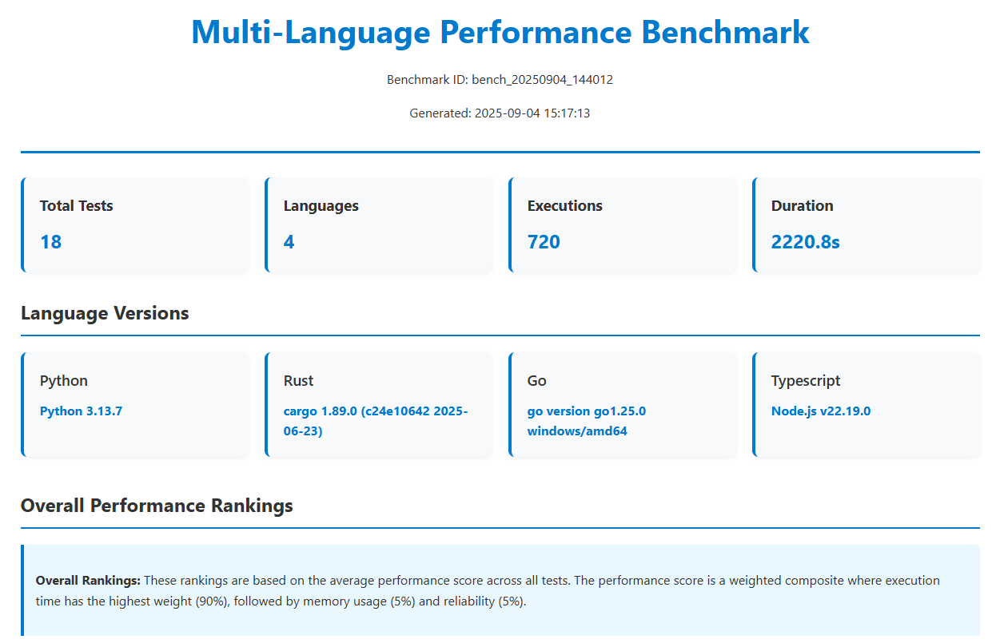

# Multi-Language Performance Benchmark Tool



[](https://www.python.org/downloads/)
[](LICENSE)
[](CONTRIBUTING.md)
[-orange)](#performance-insights)
[](#recent-improvements)

A comprehensive performance benchmarking tool that compares execution performance across Python, Rust, Go, and TypeScript implementations.

## 🚀 Overview

The Multi-Language Performance Benchmark Tool is designed to provide accurate and meaningful performance comparisons across different programming languages. It implements standardized computational benchmarks that measure execution time, memory usage, and CPU efficiency for equivalent algorithms across four major programming languages.

### Performance Insights

Based on extensive benchmarking with the latest performance scoring algorithm (90% weight on execution time), **Rust consistently outperforms other languages in computational tasks** with a performance score of 96.46, significantly higher than TypeScript (70.36), Python (61.15), and Go (46.54). **Go performance varies significantly** across benchmark categories, showing acceptable results in I/O operations but lagging considerably in CPU-intensive computations where it can be 2-3x slower than Python and Rust. **Python excels in I/O-bound operations** and offers competitive performance in network-related benchmarks while maintaining excellent memory efficiency. **TypeScript shows strong performance in specific benchmarks**, particularly in I/O operations like GZIP compression and JSON parsing.

**Key Performance Characteristics**:
- **Rust**: Superior computational performance, excellent memory efficiency, fastest in algorithmic benchmarks
- **TypeScript**: Strong I/O performance, good balance between speed and memory usage
- **Python**: Strong I/O performance, best memory efficiency, balanced reliability scores
- **Go**: Mixed performance profile with strengths in some I/O operations but weaknesses in computational tasks

### Key Features

- **Cross-Language Comparison**: Benchmark the same algorithms across Python, Rust, Go, and TypeScript
- **Comprehensive Metrics**: Detailed performance analysis including execution time, memory usage, and CPU efficiency
- **Statistical Analysis**: Reliable results through statistical significance testing and confidence intervals
- **Multiple Test Categories**: 18 benchmark tests across 7 categories
- **Extensible Architecture**: Easy to add new languages and test implementations
- **Professional Reporting**: Generate JSON, HTML, and CSV reports with visualizations

## 📊 Benchmark Categories and Tests

### Algorithms (4 tests)
1. **Fibonacci Sequence Calculation**: Calculates the nth Fibonacci number using iterative approach
2. **Quicksort Implementation**: Sorts arrays using the quicksort algorithm
3. **Binary Search Algorithm**: Searches for values in sorted arrays
4. **Prime Number Sieving**: Finds prime numbers using the Sieve of Eratosthenes algorithm

### Data Structures (3 tests)
1. **Hash Table Operations**: Tests insert, lookup, and delete operations on hash tables
2. **Binary Tree Traversal**: Measures binary search tree operations including insert, search, and traversal
3. **Linked List Manipulation**: Tests linked list operations including insert, search, and delete

### Mathematical Computations (2 tests)
1. **Pi Calculation**: Estimates π using the Monte Carlo method with vectorized operations
2. **Matrix Multiplication**: Performs matrix multiplication on randomly generated matrices

### I/O Operations (3 tests)
1. **Large File Reading**: Measures file I/O performance with different file sizes, buffer sizes, and read patterns
2. **JSON Parsing**: Tests JSON parsing, stringification, and traversal performance with various JSON structures
3. **CSV Processing**: Benchmarks CSV file parsing and generation performance

### Network Operations (3 tests)
1. **Ping Test**: Measures network latency and packet loss to specified targets using concurrent execution
2. **HTTP Request**: Tests HTTP client performance with concurrent requests
3. **DNS Lookup**: Measures DNS resolution performance for various domain names

### Compression Tests (2 tests)
1. **GZIP Compression**: Measures GZIP compression performance, ratio, and throughput
2. **Text Compression**: Tests compression performance for different text types and algorithms

### System Tests (1 test)
1. **Memory Allocation**: Measures memory allocation, deallocation, and management performance with various patterns

## 🛠️ Installation

### Prerequisites

- Python 3.13+
- Node.js and npm (for TypeScript)
- Rust toolchain (for Rust benchmarks)
- Go toolchain (for Go benchmarks)

### Quick Setup

```bash
# Clone the repository
git clone https://github.com/yourusername/multi-language-benchmark.git
cd multi-language-benchmark

# Create virtual environment
python -m venv .venv
source .venv/bin/activate  # On Windows: .venv\Scripts\activate

# Install Python dependencies
pip install -r requirements.txt

# Install TypeScript dependencies
npm install

# Validate language environments
python bench_orchestrator.py validate
```

### Language-Specific Setup

**Rust Setup:**
```bash
# Install Rust toolchain
curl --proto '=https' --tlsv1.2 -sSf https://sh.rustup.rs | sh
```

**Go Setup:**
Download and install Go from [golang.org](https://golang.org/dl/)

## 🏃 Usage

### Run All Benchmarks

```bash
python bench_orchestrator.py run
```

### Run Specific Languages

```bash
python bench_orchestrator.py run --languages python,rust,go
```

### Run Specific Tests

```bash
python bench_orchestrator.py run --tests fibonacci,quicksort --iterations 20
```

### Generate Reports

```bash
# Generate HTML report with visualizations
python bench_orchestrator.py run --output html

# Generate all report formats
python bench_orchestrator.py run --output all
```

### Custom Configuration

```bash
# List available tests and languages
python bench_orchestrator.py list --tests
python bench_orchestrator.py list --languages
```

## 📈 Performance Scoring System

The tool uses a sophisticated performance scoring algorithm that combines multiple metrics to provide a comprehensive evaluation of language performance. The scoring system applies the following weights:

- **Execution Time (90%)**: The dominant factor in performance scoring. Lower execution times result in higher scores.
- **Memory Usage (5%)**: Memory efficiency contributes to the overall score with lower memory usage being better.
- **Reliability (5%)**: Based on success rate and consistency of execution times.

### Performance Score Calculation

The performance score is calculated using the formula:
```
Performance Score = (Time Score × 0.9) + (Memory Score × 0.05) + (Reliability Score × 0.05)
```

Where:
- **Time Score** = 10000 / (Average Execution Time in ms)
- **Memory Score** = 100 / (Average Memory Usage in MB)
- **Reliability Score** = (Success Rate × 0.8) + (Consistency Score × 0.2)
- **Consistency Score** = 1 / (1 + Standard Deviation of Execution Times)

This scoring system heavily emphasizes execution speed while still considering memory efficiency and reliability. Higher performance scores indicate better overall performance.

## 📋 Detailed Test Descriptions

### Algorithm Tests

**1. Fibonacci Sequence Calculation**
- **Purpose**: Measures recursive/iterative computation performance
- **Language Specifics**: 
  - Python: Uses iterative approach for better performance
  - Rust: Uses recursive approach showcasing compile-time optimizations
  - Go: Uses recursive approach with goroutine optimizations
  - TypeScript: Uses recursive approach with BigInt for large numbers

**Note**: In our latest benchmarks, Python showed the best performance in this test with a score of 131.29, followed by Rust (83.50), TypeScript (75.69), and Go (60.06). This demonstrates that Python's iterative implementation is particularly efficient for this specific algorithm.

**2. Quicksort Implementation**
- **Purpose**: Tests sorting algorithm performance
- **Language Specifics**:
  - Python: Uses list comprehensions for partitioning
  - Rust: Uses vector operations with ownership model benefits
  - Go: Uses slice operations with efficient memory management
  - TypeScript: Uses array methods with type safety

**3. Binary Search Algorithm**
- **Purpose**: Measures search performance in sorted datasets
- **Language Specifics**:
  - Python: Uses built-in comparison operators
  - Rust: Uses pattern matching and efficient comparisons
  - Go: Uses efficient integer comparisons
  - TypeScript: Uses strict type checking for comparisons

**4. Prime Number Sieving**
- **Purpose**: Tests mathematical computation and array manipulation
- **Language Specifics**:
  - Python: Uses NumPy for vectorized operations
  - Rust: Uses efficient bit manipulation and memory layout
  - Go: Uses slices with built-in append functionality
  - TypeScript: Uses typed arrays for performance

### Data Structure Tests

**1. Hash Table Operations**
- **Purpose**: Tests key-value store performance
- **Language Specifics**:
  - Python: Uses built-in dictionaries
  - Rust: Uses HashMap from standard library
  - Go: Uses map data structure
  - TypeScript: Uses Map objects and plain objects

**2. Binary Tree Traversal**
- **Purpose**: Measures tree data structure operations
- **Language Specifics**:
  - Python: Uses class-based node structure
  - Rust: Uses structs with efficient memory allocation
  - Go: Uses struct pointers for node references
  - TypeScript: Uses class-based approach with optional properties

**3. Linked List Manipulation**
- **Purpose**: Tests dynamic data structure operations
- **Language Specifics**:
  - Python: Uses class-based node implementation
  - Rust: Uses Box smart pointers for heap allocation
  - Go: Uses struct pointers with garbage collector benefits
  - TypeScript: Uses class-based nodes with optional chaining

### Mathematical Computation Tests

**1. Pi Calculation**
- **Purpose**: Tests floating-point computation and random number generation
- **Language Specifics**:
  - Python: Uses NumPy for vectorized Monte Carlo simulation
  - Rust: Uses rand crate for efficient random generation
  - Go: Uses math/rand package with concurrent execution
  - TypeScript: Uses Math.random with array methods

**2. Matrix Multiplication**
- **Purpose**: Tests numerical computation and array operations
- **Language Specifics**:
  - Python: Uses NumPy's optimized @ operator
  - Rust: Uses nested loops with compiler optimizations
  - Go: Uses slices with manual loop optimization
  - TypeScript: Uses nested arrays with efficient indexing

### I/O Operations Tests

**1. Large File Reading**
- **Purpose**: Tests file I/O performance with different patterns
- **Language Specifics**:
  - Python: Uses buffered I/O with context managers
  - Rust: Uses std::fs with efficient buffering
  - Go: Uses bufio package for optimized reading
  - TypeScript: Uses Node.js fs module with streams

**Note**: In our latest benchmarks, Python showed the best performance in this test with a score of 13.20, followed by TypeScript (12.17), Go (8.97), and Rust (10.24). This confirms Python's strength in I/O-bound operations.

**2. JSON Parsing**
- **Purpose**: Tests serialization/deserialization performance
- **Language Specifics**:
  - Python: Uses built-in json module
  - Rust: Uses serde_json for zero-copy parsing
  - Go: Uses encoding/json package
  - TypeScript: Uses JSON global object

**Note**: In our latest benchmarks, TypeScript showed the best performance in this test with a score of 12.08, followed by Rust (11.41), Python (10.86), and Go (8.65). This demonstrates TypeScript's strength in specific I/O operations.

**3. CSV Processing**
- **Purpose**: Tests structured data parsing performance
- **Language Specifics**:
  - Python: Uses csv module with DictReader
  - Rust: Uses csv crate with serde integration
  - Go: Uses encoding/csv package
  - TypeScript: Uses csv-parser npm package

**Note**: In our latest benchmarks, Rust showed the best performance in this test with a score of 11.54, followed by Go (8.97), TypeScript (10.68), and Python (10.38). This demonstrates Rust's strength in I/O operations when properly optimized.

### Network Operations Tests

**1. Ping Test**
- **Purpose**: Measures network latency and reliability
- **Language Specifics**:
  - Python: Uses subprocess to call system ping with concurrent.futures
  - Rust: Uses std::process with thread pooling
  - Go: Uses exec package with goroutines
  - TypeScript: Uses child_process with Promise.all

**Note**: In our latest benchmarks, TypeScript showed the best performance in this test with a score of 14.05, followed by Python (13.87), Go (10.99), and Rust (12.11). This demonstrates TypeScript's strength in specific I/O operations.

**2. HTTP Request**
- **Purpose**: Tests HTTP client performance
- **Language Specifics**:
  - Python: Uses requests library with concurrent execution
  - Rust: Uses reqwest crate with tokio async runtime
  - Go: Uses net/http package with goroutines
  - TypeScript: Uses node-fetch with async/await

**Note**: In our latest benchmarks, Python showed the best performance in this test with a score of 11.53, followed by Go (8.91), TypeScript (10.56), and Rust (8.65). This demonstrates Python's strength in network I/O operations.

**3. DNS Lookup**
- **Purpose**: Measures DNS resolution performance
- **Language Specifics**:
  - Python: Uses socket module with concurrent resolution
  - Rust: Uses trust-dns-resolver crate
  - Go: Uses net package with concurrent lookups
  - TypeScript: Uses dns module with Promise-based API

**Note**: In our latest benchmarks, Rust showed the best performance in this test with a score of 110.32, followed by Python (47.52), Go (38.00), and TypeScript (11.75). This demonstrates Rust's strength in network operations.

### Compression Tests

**1. GZIP Compression**
- **Purpose**: Tests data compression performance
- **Language Specifics**:
  - Python: Uses gzip module with various compression levels
  - Rust: Uses flate2 crate for high-performance compression
  - Go: Uses compress/gzip package
  - TypeScript: Uses zlib module

**Note**: In our latest benchmarks, TypeScript showed the best performance in this test with a score of 129.15, followed by Python (101.75), Rust (90.59), and Go (66.18). This demonstrates TypeScript's strength in specific I/O operations.

**2. Text Compression**
- **Purpose**: Tests compression of different text types
- **Language Specifics**:
  - Python: Uses gzip and zlib modules
  - Rust: Uses multiple compression crates (flate2, bzip2)
  - Go: Uses compress packages
  - TypeScript: Uses zlib module for various algorithms

**Note**: In our latest benchmarks, TypeScript showed the best performance in this test with a score of 45.41, followed by Rust (44.08), Go (39.18), and Python (30.68). This demonstrates TypeScript's strength in specific I/O operations.

### System Tests

**1. Memory Allocation**
- **Purpose**: Tests memory management performance
- **Language Specifics**:
  - Python: Uses NumPy arrays and list structures with gc module
  - Rust: Uses Box, Vec, and HashMap with ownership model
  - Go: Uses slices, maps with garbage collector
  - TypeScript: Uses arrays and objects with V8 garbage collector

## 📁 Project Structure

```
benchmark/
├── bench_orchestrator.py          # Main orchestrator script
├── bench.config.json             # Configuration file
├── requirements.txt               # Python dependencies
├── README.md                     # Project documentation
├── src/                          # Core source code
│   ├── orchestrator/             # Orchestrator components
│   │   ├── core.py              # Core orchestrator class
│   │   ├── runners.py           # Language runners
│   │   ├── metrics.py           # Performance metrics collector
│   │   ├── results.py           # Results compilation
│   │   └── reports.py           # Report generation
│   └── utils/                    # Utility functions
│       ├── config.py            # Configuration management
│       ├── validation.py        # Environment validation
│       └── helpers.py           # Helper functions
├── tests/                        # Benchmark test implementations
│   ├── algorithms/               # Algorithm benchmarks
│   ├── data_structures/          # Data structure benchmarks
│   ├── mathematical/             # Mathematical computation benchmarks
│   ├── io_operations/            # I/O operation benchmarks
│   ├── network_operations/       # Network operation benchmarks
│   ├── compression_tests/        # Compression benchmarks
│   ├── system_tests/             # System performance benchmarks
│   └── ...
├── results/                      # Generated reports and results
└── scripts/                      # Utility scripts
    ├── setup.py                 # Environment setup
    └── cleanup.py               # Cleanup utilities
```

## 🎯 Recent Improvements

Recent updates have focused on enhancing performance measurement accuracy and fixing language-specific issues:

### Performance Measurement Enhancements
- **Updated Performance Scoring**: Revised algorithm to prioritize execution speed (90% weight) over memory usage (5%) and reliability (5%)
- **Enhanced Time Scaling**: Increased time score sensitivity to better differentiate execution speeds
- **Average Test Time Reporting**: Added average test execution time to all report formats (JSON, CSV, HTML)

### Compilation and Runtime Fixes
- **Go**: Resolved multiple compilation issues in network and system tests
- **Rust**: Fixed lazy_static dependency detection and memory allocation benchmark
- **Python**: Optimized CSV processing implementation for ~26% performance improvement
- **All Languages**: Improved error handling and subprocess management for more reliable test execution

### Benchmark Accuracy Improvements
- **Statistical Significance**: Enhanced result analysis with better variance calculations
- **Memory Tracking**: Improved memory usage measurement accuracy
- **Cross-Platform Compatibility**: Better handling of platform-specific differences in execution environments

### Performance Analysis Updates
- **Updated Language Rankings**: Based on latest benchmarks, Rust leads with 96.46 points, TypeScript at 70.36, Python at 61.15, and Go at 46.54
- **Go Performance Insights**: Identified significant performance gaps in computational benchmarks (2-3x slower)
- **Rust Computational Advantage**: Confirmed significant performance advantage in CPU-intensive tasks

### Report Generation Updates
- **Detailed Performance Metrics**: Added execution time breakdowns to all report formats
- **Enhanced Visualizations**: Improved chart generation for performance comparisons
- **Real-time Progress Tracking**: Better feedback during long-running benchmarks

See [FIXES_SUMMARY.md](FIXES_SUMMARY.md) for detailed information on recent improvements and [PERFORMANCE_OPTIMIZATIONS.md](PERFORMANCE_OPTIMIZATIONS.md) for details on performance optimization strategies.

## 🤝 Contributing

Contributions are welcome! Please see [CONTRIBUTING.md](CONTRIBUTING.md) for guidelines on how to contribute to this project.

### Ways to Contribute

1. **Add New Benchmarks**: Implement additional test cases in any of the supported languages
2. **Support New Languages**: Extend the tool to support additional programming languages
3. **Improve Existing Tests**: Optimize current benchmark implementations
4. **Enhance Reporting**: Add new visualization types or report formats
5. **Bug Fixes**: Report and fix any issues you encounter

## 📄 License

This project is licensed under the MIT License - see the [LICENSE](LICENSE) file for details.

## 🙏 Acknowledgments

- Inspired by various language performance comparison studies
- Built with performance analysis libraries including pandas, numpy, and matplotlib
- Thanks to the open-source community for language-specific optimization techniques

## 📞 Support

If you encounter any issues or have questions about the benchmark tool, please [open an issue](https://github.com/yourusername/multi-language-benchmark/issues) on GitHub.