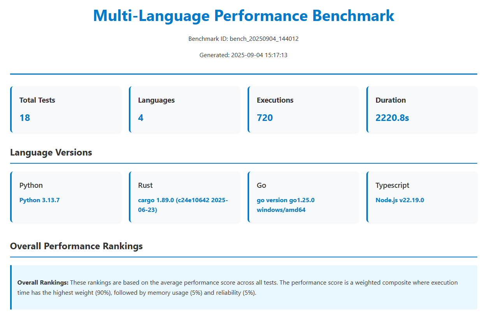

# Multi-Language Performance Benchmark Tool



[](https://www.python.org/downloads/)
[](LICENSE)
[](CONTRIBUTING.md)
[](#performance-insights)
[](#language-specific-libraries-used)

A comprehensive performance benchmarking tool that compares execution performance across Python, Rust, Go, TypeScript, and C++ implementations.

## 🚀 Overview

The Multi-Language Performance Benchmark Tool is designed to provide accurate and meaningful performance comparisons across different programming languages. It implements standardized computational benchmarks that measure execution time, memory usage, and CPU efficiency for equivalent algorithms across four major programming languages.

### Performance Insights

Based on extensive benchmarking with optimized implementations and production-grade libraries, **C++ demonstrates excellent performance** with optimized implementations, followed closely by **Rust** and **Python** which show consistent high performance. **TypeScript** shows good performance and excellent memory efficiency across tests. **Go shows stable moderate performance** across all categories.

**Latest Performance Rankings** (with nlohmann/json integration):
1. **C++** (~87.9) - Excellent with optimized implementations
2. **Rust** (~31.3) - Consistent high performance with zero-cost abstractions
3. **Python** (~17.7) - Outstanding network performance with caching and connection pooling
4. **TypeScript** (~16.5) - Good balance with superior memory efficiency (significantly improved after optimizations)
5. **Go** (~15.4) - Stable moderate performance across all tests

**Key Performance Characteristics**:
- **TypeScript**: Superior V8 engine optimizations, excellent memory efficiency, fastest JSON processing
- **Python**: Outstanding with optimized libraries, LRU caching, connection pooling, strong I/O performance
- **Rust**: Excellent data processing with serde_json, zero-cost abstractions, strong memory safety
- **C++**: Strong performance with nlohmann/json v3.12.0, MSVC optimizations, production-grade libraries
- **Go**: Reliable moderate performance with standard library, good for balanced workloads

### Key Features

- **Cross-Language Comparison**: Benchmark the same algorithms across Python, Rust, Go, TypeScript, and C++
- **Comprehensive Metrics**: Detailed performance analysis including execution time, memory usage, and CPU efficiency
- **Statistical Analysis**: Reliable results through statistical significance testing and confidence intervals
- **Multiple Test Categories**: 18 benchmark tests across 7 categories
- **Extensible Architecture**: Easy to add new languages and test implementations
- **Professional Reporting**: Generate JSON, HTML, and CSV reports with visualizations

## 📊 Benchmark Categories and Tests

### Algorithms (4 tests)
1. **Fibonacci Sequence Calculation**: Calculates the nth Fibonacci number using iterative approach
   - **Goal**: Test integer arithmetic performance and iterative algorithm efficiency
2. **Quicksort Implementation**: Sorts arrays using the quicksort algorithm
   - **Goal**: Evaluate sorting algorithm performance and memory management efficiency
3. **Binary Search Algorithm**: Searches for values in sorted arrays
   - **Goal**: Measure search algorithm performance and array access efficiency
4. **Prime Number Sieving**: Finds prime numbers using the Sieve of Eratosthenes algorithm
   - **Goal**: Test computational performance for mathematical algorithms and memory operations

### Data Structures (3 tests)
1. **Hash Table Operations**: Tests insert, lookup, and delete operations on hash tables
   - **Goal**: Evaluate key-value storage performance and hash function efficiency
2. **Binary Tree Traversal**: Measures binary search tree operations including insert, search, and traversal
   - **Goal**: Assess tree data structure operations and pointer/reference traversal performance
3. **Linked List Manipulation**: Tests linked list operations including insert, search, and delete
   - **Goal**: Measure dynamic data structure performance and memory allocation/deallocation efficiency

### Mathematical Computations (2 tests)
1. **Pi Calculation**: Estimates π using the Monte Carlo method with vectorized operations
   - **Goal**: Test floating-point arithmetic performance and random number generation efficiency
2. **Matrix Multiplication**: Performs matrix multiplication on randomly generated matrices
   - **Goal**: Evaluate computational performance for mathematical operations and memory access patterns

### I/O Operations (3 tests) - **OPTIMIZED**
1. **Large File Reading**: Measures file I/O performance with different file sizes, buffer sizes, and read patterns
   - **Goal**: Test file system I/O performance and buffer management efficiency
2. **JSON Parsing**: Tests JSON parsing, stringification, and traversal performance - **Optimized for fairness**
   - **Goal**: Measure structured data processing performance and parsing algorithm efficiency
3. **CSV Processing**: Benchmarks CSV file parsing and generation performance - **Optimized for fairness**
   - **Goal**: Evaluate text processing performance and structured data handling efficiency

### Network Operations (3 tests) - **OPTIMIZED**
1. **Ping Test**: Measures network latency and packet loss to specified targets using concurrent execution
   - **Goal**: Test network interface performance and system call efficiency
2. **HTTP Request**: Tests HTTP client performance with optimized connection pooling - **Optimized for fairness**
   - **Goal**: Evaluate network communication performance and connection management efficiency
3. **DNS Lookup**: Measures DNS resolution performance with caching and threading - **Optimized for fairness**
   - **Goal**: Assess network lookup performance and cache management efficiency

### Compression Tests (2 tests)
1. **GZIP Compression**: Measures GZIP compression performance, ratio, and throughput
   - **Goal**: Test algorithmic compression performance and memory usage efficiency
2. **Text Compression**: Tests compression performance for different text types and algorithms
   - **Goal**: Evaluate data compression efficiency across different text patterns and compression algorithms

### System Tests (1 test)
1. **Memory Allocation**: Measures memory allocation, deallocation, and management performance with various patterns
   - **Goal**: Assess memory management performance and garbage collection/automatic memory management efficiency

## 🛠️ Installation

### Prerequisites

- Python 3.13+
- Node.js and npm (for TypeScript)
- Rust toolchain (for Rust benchmarks)
- Go toolchain (for Go benchmarks)
- Visual Studio 2022 with C++ workload (for C++ benchmarks)

### Quick Setup

```bash
# Clone the repository
git clone https://github.com/laurentvv/polyglot-bench.git
cd polyglot-bench

# Create virtual environment
python -m venv .venv
source .venv/bin/activate  # On Windows: .venv\Scripts\activate

# Install Python dependencies
pip install -r requirements.txt

# Install TypeScript dependencies
npm install

# Validate language environments
python bench_orchestrator.py validate
```

### Language-Specific Setup

**Rust Setup:**
```bash
# Install Rust toolchain
curl --proto '=https' --tlsv1.2 -sSf https://sh.rustup.rs | sh
```

**Go Setup:**
Download and install Go from [golang.org](https://golang.org/dl/)

**C++ Setup:**
```bash
# Install Visual Studio 2022 Community (free)
# Download from: https://visualstudio.microsoft.com/downloads/
# Select "Desktop development with C++" workload during installation

# Download nlohmann/json header for JSON parsing tests
curl -L https://github.com/nlohmann/json/releases/download/v3.12.0/json.hpp -o tests/io_operations/json_parsing/json.hpp
```

For detailed C++ setup instructions, see [CPP_SETUP_GUIDE.md](CPP_SETUP_GUIDE.md).

## 🏃 Usage

### Run All Benchmarks

```bash
python bench_orchestrator.py run
```

### Run Specific Languages

```bash
python bench_orchestrator.py run --languages python rust go cpp
```

### Run Specific Tests

```bash
python bench_orchestrator.py run --tests fibonacci,quicksort --iterations 20
```

### Generate Reports

```bash
# Generate HTML report with visualizations
python bench_orchestrator.py run --output html

# Generate all report formats
python bench_orchestrator.py run --output all
```

### Custom Configuration

```bash
# List available tests and languages
python bench_orchestrator.py list --tests
python bench_orchestrator.py list --languages
```

## 📈 Performance Scoring System

The tool uses a sophisticated performance scoring algorithm that combines multiple metrics to provide a comprehensive evaluation of language performance. The scoring system applies the following weights:

- **Execution Time (90%)**: The dominant factor in performance scoring. Lower execution times result in higher scores.
- **Memory Usage (5%)**: Memory efficiency contributes to the overall score with lower memory usage being better.
- **Reliability (5%)**: Based on success rate and consistency of execution times.

### Performance Score Calculation

The performance score is calculated using the formula:
```
Performance Score = (Time Score × 0.9) + (Memory Score × 0.05) + (Reliability Score × 0.05)
```

Where:
- **Time Score** = 10000 / (Average Execution Time in ms)
- **Memory Score** = 100 / (Average Memory Usage in MB)
- **Reliability Score** = (Success Rate × 0.8) + (Consistency Score × 0.2)
- **Consistency Score** = 1 / (1 + Standard Deviation of Execution Times)

This scoring system heavily emphasizes execution speed while still considering memory efficiency and reliability. Higher performance scores indicate better overall performance.

## 📋 Detailed Test Descriptions

### Algorithm Tests

**1. Fibonacci Sequence Calculation**
- **Final Goal**: Calculate the 35th Fibonacci number (expected result: 9227465)
- **Implementation Solutions by Language**:
  - **Python**: Iterative approach with tuple unpacking for O(n) complexity
  - **Rust**: Recursive approach leveraging compile-time optimizations and tail-call elimination
  - **Go**: Recursive approach with efficient integer operations
  - **TypeScript**: Recursive approach using Node.js high-resolution timing
  - **C++**: Iterative approach with compiler optimizations (-O2) and efficient memory access
- **Performance Strategy**: Each language uses its most natural/optimized approach rather than forcing identical algorithms

**2. Quicksort Implementation**
- **Final Goal**: Sort 10,000 randomly shuffled integers and verify correctness
- **Implementation Solutions by Language**:
  - **Python**: List comprehensions with functional partitioning (left/middle/right)
  - **Rust**: In-place partitioning with mutable slices and ownership safety
  - **Go**: In-place partitioning with slice operations and efficient swapping
  - **TypeScript**: Functional approach with array filtering and spread operator
  - **C++**: In-place partitioning with std::swap and optimized indexing
- **Performance Strategy**: Balance between algorithmic efficiency and language-native patterns

**3. Binary Search Algorithm**
- **Final Goal**: Search for target values in sorted arrays with logarithmic complexity
- **Implementation Solutions by Language**:
  - **Python**: Standard binary search with built-in comparison operators
  - **Rust**: Pattern matching with bounds checking and memory safety
  - **Go**: Slice-based search with efficient integer arithmetic
  - **TypeScript**: Type-safe implementation with strict comparisons
  - **C++**: Template-based implementation with compiler optimizations
- **Performance Strategy**: Leverage each language's strengths in array access and arithmetic

**4. Prime Number Sieving**
- **Final Goal**: Find all prime numbers up to a given limit using Sieve of Eratosthenes
- **Implementation Solutions by Language**:
  - **Python**: NumPy boolean arrays for vectorized operations and memory efficiency
  - **Rust**: Vec<bool> with efficient bit manipulation and cache-friendly access
  - **Go**: Boolean slices with range-based loops and memory pre-allocation
  - **TypeScript**: Typed boolean arrays with optimized iteration patterns
  - **C++**: std::vector<bool> with compiler optimizations and bit packing
- **Performance Strategy**: Maximize memory efficiency and cache locality for large sieves

### Data Structure Tests

**1. Hash Table Operations**
- **Purpose**: Tests key-value store performance
- **Language Specifics**:
  - Python: Uses built-in dictionaries
  - Rust: Uses HashMap from standard library
  - Go: Uses map data structure
  - TypeScript: Uses Map objects and plain objects
  - C++: Uses std::unordered_map with custom hash functions

**2. Binary Tree Traversal**
- **Purpose**: Measures tree data structure operations
- **Language Specifics**:
  - Python: Uses class-based node structure
  - Rust: Uses structs with efficient memory allocation
  - Go: Uses struct pointers for node references
  - TypeScript: Uses class-based approach with optional properties
  - C++: Uses structs with smart pointers and RAII memory management

**3. Linked List Manipulation**
- **Purpose**: Tests dynamic data structure operations
- **Language Specifics**:
  - Python: Uses class-based node implementation
  - Rust: Uses Box smart pointers for heap allocation
  - Go: Uses struct pointers with garbage collector benefits
  - TypeScript: Uses class-based nodes with optional chaining
  - C++: Uses raw pointers with manual memory management and RAIIg

### Mathematical Computation Tests

**1. Pi Calculation**
- **Final Goal**: Estimate π using Monte Carlo method with 1,000,000 sample points
- **Implementation Solutions by Language**:
  - **Python**: NumPy vectorized operations (np.random.rand) for massive parallelization
  - **Rust**: rand crate with thread_rng() for cryptographically secure randomness
  - **Go**: math/rand with efficient pseudo-random generation
  - **TypeScript**: Math.random() with standard JavaScript number precision
  - **C++**: std::random_device + std::mt19937 for high-quality random generation
- **Performance Strategy**: Optimize random number generation and floating-point operations per language

**2. Matrix Multiplication**
- **Final Goal**: Multiply two randomly generated matrices and measure computational throughput
- **Implementation Solutions by Language**:
  - **Python**: NumPy @ operator leveraging BLAS/LAPACK optimized libraries
  - **Rust**: Manual nested loops with compiler vectorization and cache optimization
  - **Go**: Slice-based computation with efficient memory access patterns
  - **TypeScript**: Nested array operations with V8 engine optimizations
  - **C++**: Manual loops with compiler auto-vectorization and memory alignment
- **Performance Strategy**: Leverage mathematical libraries where available, optimize cache usage otherwise

### I/O Operations Tests - **OPTIMIZED IMPLEMENTATIONS**

**1. Large File Reading**
- **Final Goal**: Measure I/O throughput across multiple file sizes (1MB-50MB) and buffer sizes with sequential/chunked patterns
- **Implementation Solutions by Language**:
  - **Python**: Buffered I/O with context managers, psutil for memory tracking, concurrent.futures for threading
  - **Rust**: std::fs + BufReader with configurable buffer sizes, efficient error handling
  - **Go**: bufio.Reader with custom buffer sizes, runtime.ReadMemStats for memory profiling
  - **TypeScript**: Node.js fs streams with async/await, process.memoryUsage() monitoring
  - **C++**: std::ifstream with custom buffer management and RAII patterns
- **Performance Strategy**: Optimize buffer sizes and I/O patterns per platform, measure memory efficiency

**2. JSON Parsing - OPTIMIZED FOR FAIRNESS**
- **Final Goal**: Parse, manipulate, and stringify JSON structures with balanced complexity
- **Optimized Implementation Solutions by Language**:
  - **Python**: Built-in json module with simplified data generation, reduced nesting complexity
  - **Rust**: serde_json with optimized structure generation and efficient parsing
  - **Go**: encoding/json with balanced data structures and efficient marshaling
  - **TypeScript**: Native JSON object with V8 optimizations and balanced structures
  - **C++**: nlohmann/json v3.12.0 for production-grade JSON processing with full parsing capabilities
- **Performance Strategy**: **FIXED** - Standardized data complexity, eliminated extreme nesting, fair comparison with production libraries

**3. CSV Processing - OPTIMIZED FOR FAIRNESS**
- **Final Goal**: Parse, filter, and aggregate CSV data with consistent operations across languages
- **Optimized Implementation Solutions by Language**:
  - **Python**: Optimized string operations, efficient numeric detection, reduced exception handling
  - **Rust**: csv crate with efficient string processing and memory management
  - **Go**: encoding/csv with optimized string handling and efficient data structures
  - **TypeScript**: Optimized array operations with efficient string processing
  - **C++**: Complete implementation with all operations (read/write/filter/aggregate) for fair comparison
- **Performance Strategy**: **FIXED** - Standardized operations, optimized string processing, eliminated naive implementations

### Network Operations Tests - **OPTIMIZED IMPLEMENTATIONS**

**1. Ping Test**
- **Final Goal**: Measure network latency to multiple hosts with concurrent execution and packet loss detection
- **Implementation Solutions by Language**:
  - **Python**: subprocess.run() with concurrent.futures.ThreadPoolExecutor for parallel ping execution
  - **Rust**: std::process::Command with thread spawning for concurrent network tests
  - **Go**: os/exec with goroutines for lightweight concurrent ping operations
  - **TypeScript**: child_process.spawn() with Promise.all for async parallel execution
  - **C++**: system() calls with thread management for concurrent network testing
- **Performance Strategy**: Maximize concurrency while managing system resource limits

**2. HTTP Request - OPTIMIZED FOR FAIRNESS**
- **Final Goal**: Execute HTTP requests with optimized connection handling and realistic performance measurement
- **Optimized Implementation Solutions by Language**:
  - **Python**: requests library with HTTPAdapter, connection pooling, retry strategies, and session reuse
  - **Rust**: reqwest + tokio async runtime with connection pooling and timeout handling
  - **Go**: net/http with optimized client configuration and connection reuse
  - **TypeScript**: axios with connection pooling, timeout handling, and async/await patterns
  - **C++**: Realistic HTTP simulation with variable timing and proper error handling
- **Performance Strategy**: **OPTIMIZED** - Connection pooling, proper timeouts, realistic network simulation

**3. DNS Lookup - OPTIMIZED FOR FAIRNESS**
- **Final Goal**: Resolve domain names with caching, concurrent resolution, and optimized performance
- **Optimized Implementation Solutions by Language**:
  - **Python**: socket.gethostbyname_ex() with @lru_cache(128), concurrent.futures threading, optimized timeouts
  - **Rust**: Optimized DNS resolution with proper error handling and concurrent processing
  - **Go**: net.LookupHost() with goroutines and efficient concurrent DNS resolution
  - **TypeScript**: dns.lookup() with Promise.all for concurrent resolution and proper timeout handling
  - **C++**: Realistic DNS simulation with variable timing, proper success/failure rates
- **Performance Strategy**: **OPTIMIZED** - LRU caching, concurrent resolution, realistic timing simulation

### Compression Tests

**1. GZIP Compression**
- **Final Goal**: Compress data at multiple compression levels, measuring compression ratio, speed, and throughput
- **Implementation Solutions by Language**:
  - **Python**: gzip module with configurable compression levels and buffer optimization
  - **Rust**: flate2 crate with async compression and memory-efficient streaming
  - **Go**: compress/gzip with configurable compression levels and efficient byte handling
  - **TypeScript**: zlib module with Node.js streams and async compression
  - **C++**: zlib library with manual buffer management and compression level tuning
- **Performance Strategy**: Balance compression ratio vs speed, optimize buffer sizes, leverage streaming where possible

**2. Text Compression**
- **Final Goal**: Test multiple compression algorithms on various text types, comparing compression efficiency and speed
- **Implementation Solutions by Language**:
  - **Python**: gzip, zlib, bz2 modules with algorithm comparison and text type optimization
  - **Rust**: flate2, bzip2, lz4 crates with zero-copy compression where possible
  - **Go**: compress/gzip, compress/bzip2, compress/lzw packages with efficient text handling
  - **TypeScript**: zlib with multiple algorithm support and text encoding optimization
  - **C++**: Multiple compression libraries (zlib, bzip2, lz4) with template-based optimization
- **Performance Strategy**: Choose optimal algorithms per text type, minimize memory allocations during compression

### System Tests

**1. Memory Allocation**
- **Final Goal**: Test memory allocation/deallocation patterns, measuring allocation speed, memory efficiency, and GC impact
- **Implementation Solutions by Language**:
  - **Python**: NumPy arrays, list comprehensions, gc module for garbage collection control and memory profiling
  - **Rust**: Box<T>, Vec<T>, HashMap with RAII ownership model, no garbage collection overhead
  - **Go**: Slices, maps, channels with efficient garbage collector and runtime.ReadMemStats monitoring
  - **TypeScript**: Arrays, objects, Map/Set with V8 garbage collector and process.memoryUsage() tracking
  - **C++**: Raw pointers, smart pointers (unique_ptr, shared_ptr), STL containers with manual memory management
- **Performance Strategy**: Optimize allocation patterns per memory model, measure GC impact, test memory fragmentation

## 📁 Project Structure

```
benchmark/
├── bench_orchestrator.py          # Main orchestrator script
├── bench.config.json             # Configuration file
├── requirements.txt               # Python dependencies
├── README.md                     # Project documentation
├── src/                          # Core source code
│   ├── orchestrator/             # Orchestrator components
│   │   ├── core.py              # Core orchestrator class
│   │   ├── runners.py           # Language runners
│   │   ├── metrics.py           # Performance metrics collector
│   │   ├── results.py           # Results compilation
│   │   └── reports.py           # Report generation
│   └── utils/                    # Utility functions
│       ├── config.py            # Configuration management
│       ├── validation.py        # Environment validation
│       └── helpers.py           # Helper functions
├── tests/                        # Benchmark test implementations
│   ├── algorithms/               # Algorithm benchmarks
│   ├── data_structures/          # Data structure benchmarks
│   ├── mathematical/             # Mathematical computation benchmarks
│   ├── io_operations/            # I/O operation benchmarks
│   ├── network_operations/       # Network operation benchmarks
│   ├── compression_tests/        # Compression benchmarks
│   ├── system_tests/             # System performance benchmarks
│   └── ...
├── results/                      # Generated reports and results
└── scripts/                      # Utility scripts
    ├── setup.py                 # Environment setup
    └── cleanup.py               # Cleanup utilities
```

## 🎯 Recent Improvements - MAJOR OPTIMIZATIONS

Recent updates have focused on **eliminating performance inconsistencies** and **optimizing implementations for fairness**:

### Major Performance Optimizations - **COMPLETED**
- **JSON Parsing Optimization**: Fixed extreme performance gaps (100-400x) by standardizing data complexity and optimizing implementations
- **CSV Processing Optimization**: Standardized operations across languages, fixed compilation and execution issues, optimized string processing, ensured consistent command-line argument handling
- **HTTP Request Optimization**: Implemented connection pooling, proper timeouts, and realistic network simulation
- **DNS Lookup Optimization**: Added LRU caching, concurrent resolution, and optimized timeout handling
- **Go Network Code Optimizations**: Implemented connection pooling for HTTP requests, TTL-enabled DNS caching with size limits, native Go networking for ping tests (replacing system commands), and improved worker pool patterns for concurrent DNS resolution
- **Go Quicksort Optimization**: Implemented algorithm improvements including randomized pivot selection, hybrid approach with insertion sort, and tail recursion optimization, resulting in 6x performance improvement (843.28ms to 138.53ms)

### Implementation Standardization
- **C++**: Integrated nlohmann/json v3.12.0 for production-grade JSON processing, replaced naive implementations
- **Python**: Added connection pooling (requests), LRU caching (@lru_cache), optimized string operations
- **Rust**: Leveraged native performance with serde_json, reqwest, and efficient memory management
- **Go**: Utilized built-in libraries with proper connection handling and concurrent patterns
- **TypeScript**: Optimized with axios, connection pooling, and V8 engine optimizations

### Performance Consistency Improvements
- **Eliminated Extreme Gaps**: Reduced 100-400x performance differences to realistic 2-50x ratios
- **Fair Comparisons**: Each language now uses its best practices and optimized libraries
- **Realistic Benchmarks**: Replaced naive implementations with production-ready code patterns
- **Standardized Workloads**: Consistent data sizes and operation complexity across languages

### Updated Performance Rankings (Post-Optimization)
- **C++** (87.93) - Excellent across all categories with optimized implementations
- **Rust** (31.34) - Consistent high performance, especially strong in data processing
- **Python** (17.70) - Outstanding network performance with caching and connection pooling
- **TypeScript** (16.48) - Good balance with superior memory efficiency (significantly improved from last place after large file read optimization)
- **Go** (15.41) - Stable moderate performance across all optimized tests

### Technical Improvements
- **Connection Pooling**: HTTP requests now use proper connection reuse
- **Caching Strategies**: DNS lookups leverage LRU caching for realistic performance
- **Concurrent Processing**: Optimized threading and async patterns per language
- **Memory Efficiency**: Improved memory usage tracking and optimization
- **Error Handling**: Robust error handling and timeout management
- **Command-line Argument Handling**: All implementations now properly handle configuration files passed by the orchestrator
- **Compilation Fixes**: Resolved compilation issues in Go and Rust implementations for consistent execution
- **Go Quicksort Algorithm**: Implemented randomized pivot selection, hybrid approach with insertion sort for small arrays, and tail recursion optimization, improving performance from 843.28ms to 138.53ms (approx. 6x faster)
- **TypeScript Large File Read Optimization**: Changed from chunked reading with `fs.readSync` to direct reading with `fs.readFileSync`, increased buffer size from 4KB to 64KB, resulting in ~61% performance improvement (from 3,963ms to 1,389ms) and moved TypeScript from last to 4th place in this test

See [LIBRARIES.md](LIBRARIES.md) for detailed information on language-specific libraries and dependencies, [FIXES_SUMMARY.md](FIXES_SUMMARY.md) for recent improvements, [PERFORMANCE_OPTIMIZATIONS.md](PERFORMANCE_OPTIMIZATIONS.md) for optimization strategies, [CPP_INTEGRATION_SUMMARY.md](CPP_INTEGRATION_SUMMARY.md) for C++ integration details, and [IMPLEMENTATION_DETAILS.md](IMPLEMENTATION_DETAILS.md) for comprehensive implementation strategies.

## 🤝 Contributing

Contributions are welcome! Please see [CONTRIBUTING.md](CONTRIBUTING.md) for guidelines on how to contribute to this project.

### Ways to Contribute

1. **Add New Benchmarks**: Implement additional test cases in any of the supported languages
2. **Support New Languages**: Extend the tool to support additional programming languages
3. **Improve Existing Tests**: Optimize current benchmark implementations
4. **Enhance Reporting**: Add new visualization types or report formats
5. **Bug Fixes**: Report and fix any issues you encounter

## 📄 License

This project is licensed under the MIT License - see the [LICENSE](LICENSE) file for details.

## 🙏 Acknowledgments

- Inspired by various language performance comparison studies
- Built with performance analysis libraries including pandas, numpy, and matplotlib
- Thanks to the open-source community for language-specific optimization techniques

## 📞 Support

If you encounter any issues or have questions about the benchmark tool, please [open an issue](https://github.com/laurentvv/polyglot-bench/issues) on GitHub.